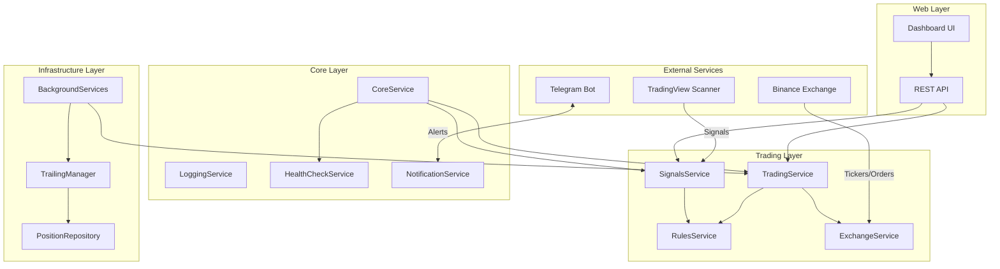
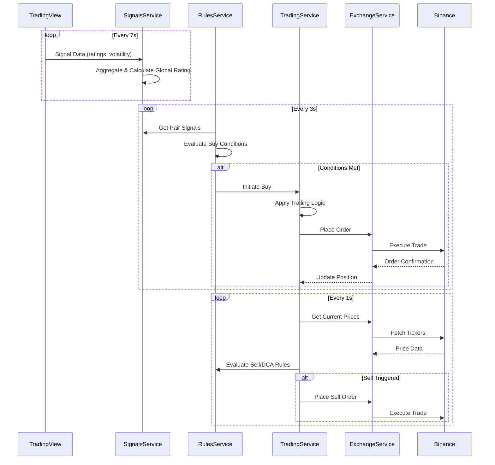
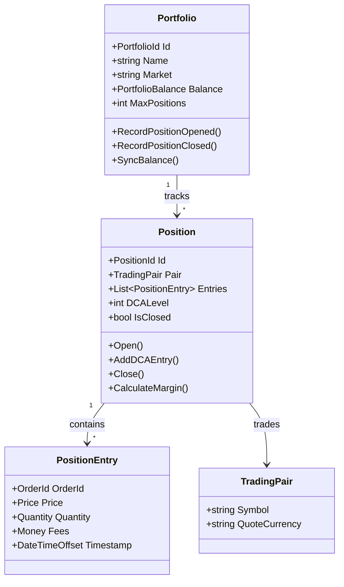
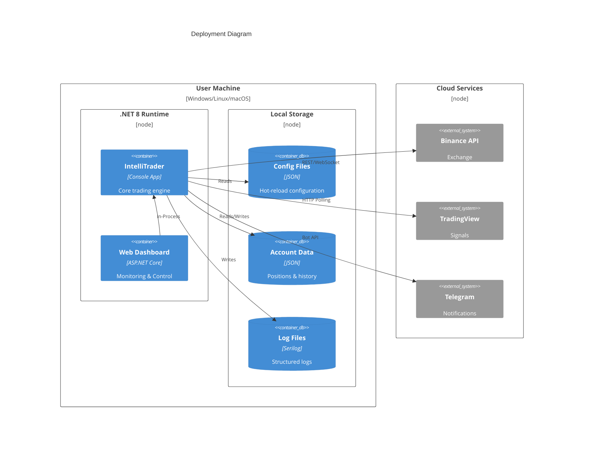

<div align="center">

# IntelliTrader

### Algorithmic Crypto Trading Bot

[](https://dotnet.microsoft.com/)
[](https://github.com/blackms/IntelliTrader/actions)
[](LICENSE)
[](https://binance.com)
[](Dockerfile)

**Intelligent signal-driven cryptocurrency trading with DCA support, trailing orders, and real-time TradingView integration.**

[Getting Started](#-getting-started) · [Features](#-features) · [Architecture](#-architecture) · [Configuration](#-configuration) · [API](#-api-overview)

</div>

---

## Mission

> Democratize algorithmic trading by providing a powerful, configurable, and extensible trading bot that leverages real-time market signals to execute intelligent trading strategies—without requiring coding expertise.

---

## Tech Stack

<table>
<tr>
<td align="center" width="150">

**Backend**

</td>
<td align="center" width="150">

**Web**

</td>
<td align="center" width="150">

**Data**

</td>
<td align="center" width="150">

**DevOps**

</td>
<td align="center" width="150">

**Integrations**

</td>
</tr>
<tr>
<td align="center">


</td>
<td align="center">


</td>
<td align="center">


</td>
<td align="center">


</td>
<td align="center">


</td>
</tr>
</table>

---

## Features

| Category | Capabilities |
|----------|-------------|
| **Trading Modes** | Virtual paper trading · Live exchange trading · Seamless mode switching |
| **Order Types** | Market orders · Trailing buy/sell · Stop-loss protection · Pair swapping |
| **DCA Strategy** | 4+ configurable DCA levels · Custom multipliers · Margin-based triggers |
| **Signal Intelligence** | TradingView integration · Multi-timeframe analysis (5m/15m/60m/240m) · Global rating aggregation |
| **Rules Engine** | Signal-based buy rules · Trading rules for sell/DCA · Specification pattern · Hot-reload config |
| **Web Dashboard** | Real-time monitoring · Manual trading controls · Performance stats · Health checks |
| **Notifications** | Telegram alerts · Trade execution notifications · Health check warnings |
| **Backtesting** | Historical snapshot replay · High-speed simulation · Strategy validation |

---

## Architecture

### System Overview



### Data Flow



### Domain Model



### Deployment View



---

## Getting Started

### Prerequisites

- [.NET 8.0 SDK](https://dotnet.microsoft.com/download/dotnet/8.0)
- Binance account (for live trading)
- TradingView access (signals are public)

### Quick Start

```bash
# Clone the repository
git clone https://github.com/blackms/IntelliTrader.git
cd IntelliTrader

# Build the solution
dotnet build IntelliTrader.sln

# Run with virtual trading (default)
dotnet run --project IntelliTrader

# Access dashboard
open http://localhost:7000
```

### Live Trading Setup

```bash
# Encrypt your API keys
dotnet run --project IntelliTrader -- \
  --encrypt \
  --path keys.bin \
  --publickey YOUR_API_KEY \
  --privatekey YOUR_API_SECRET

# Update config/trading.json
# Set "VirtualTrading": false
```

---

## Configuration

All configuration files support **hot-reload** - changes apply immediately without restart.

| File | Purpose |
|------|---------|
| `config/core.json` | Instance name, health checks, timezone |
| `config/trading.json` | Market, buy/sell settings, DCA levels |
| `config/signals.json` | TradingView signal definitions |
| `config/rules.json` | Signal rules (buy) + Trading rules (sell/DCA) |
| `config/web.json` | Dashboard port and settings |
| `config/notification.json` | Telegram bot configuration |

### Example: DCA Configuration

```json
{
  "DCALevels": [
    { "Margin": -3.0, "BuyMultiplier": 1.0, "SellMargin": 1.5 },
    { "Margin": -6.0, "BuyMultiplier": 1.5, "SellMargin": 1.0 },
    { "Margin": -10.0, "BuyMultiplier": 2.0, "SellMargin": 0.5 },
    { "Margin": -15.0, "BuyMultiplier": 2.5, "SellMargin": 0.25 }
  ]
}
```

---

## API Overview

### Status Endpoints

| Method | Endpoint | Description |
|--------|----------|-------------|
| `GET` | `/Status` | Real-time bot status, balance, health |
| `GET` | `/SignalNames` | Available signal sources |
| `POST` | `/TradingPairs` | Current positions with metrics |
| `POST` | `/MarketPairs` | Market data with signal ratings |

### Trading Endpoints

| Method | Endpoint | Description |
|--------|----------|-------------|
| `POST` | `/Buy` | Manual buy order |
| `POST` | `/Sell` | Manual sell order |
| `POST` | `/Swap` | Swap pair positions |
| `GET` | `/RefreshAccount` | Sync with exchange |

### Management Endpoints

| Method | Endpoint | Description |
|--------|----------|-------------|
| `POST` | `/Settings` | Update runtime settings |
| `POST` | `/SaveConfig` | Persist configuration |
| `GET` | `/RestartServices` | Restart all services |

---

## Roadmap

| Priority | Feature | Status |
|----------|---------|--------|
| **P1** | Multi-exchange support (Kraken, Coinbase) | Planned |
| **P1** | PostgreSQL persistence option | Planned |
| **P1** | Docker Compose deployment | In Progress |
| **P2** | GraphQL API layer | Planned |
| **P2** | Machine learning signal enhancement | Research |
| **P2** | Mobile companion app | Planned |
| **P3** | Kubernetes Helm chart | Backlog |
| **P3** | Social trading features | Backlog |

---

## Contributing

We welcome contributions! Please follow these guidelines:

1. **Fork** the repository
2. **Create** a feature branch: `git checkout -b feat/amazing-feature`
3. **Commit** with conventional commits: `feat:`, `fix:`, `docs:`, `refactor:`
4. **Test** your changes: `dotnet test`
5. **Push** to your fork: `git push origin feat/amazing-feature`
6. **Open** a Pull Request

### Development Setup

```bash
# Install dependencies
dotnet restore

# Run tests
dotnet test --collect:"XPlat Code Coverage"

# Build release
dotnet build -c Release
```

---

## License

This project is licensed under the **Creative Commons Attribution-NonCommercial-ShareAlike 4.0 International License**.

[](https://creativecommons.org/licenses/by-nc-sa/4.0/)

**Disclaimer**: Trading cryptocurrencies carries significant risk. This software is provided "AS IS" without warranty. You are solely responsible for any trading decisions and potential losses.

---

<div align="center">

**[Documentation](docs/)** · **[Report Bug](https://github.com/blackms/IntelliTrader/issues)** · **[Request Feature](https://github.com/blackms/IntelliTrader/issues)**

Built with passion by the IntelliTrader community

</div>
