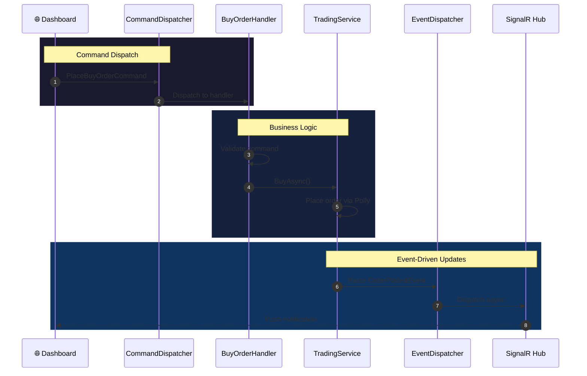
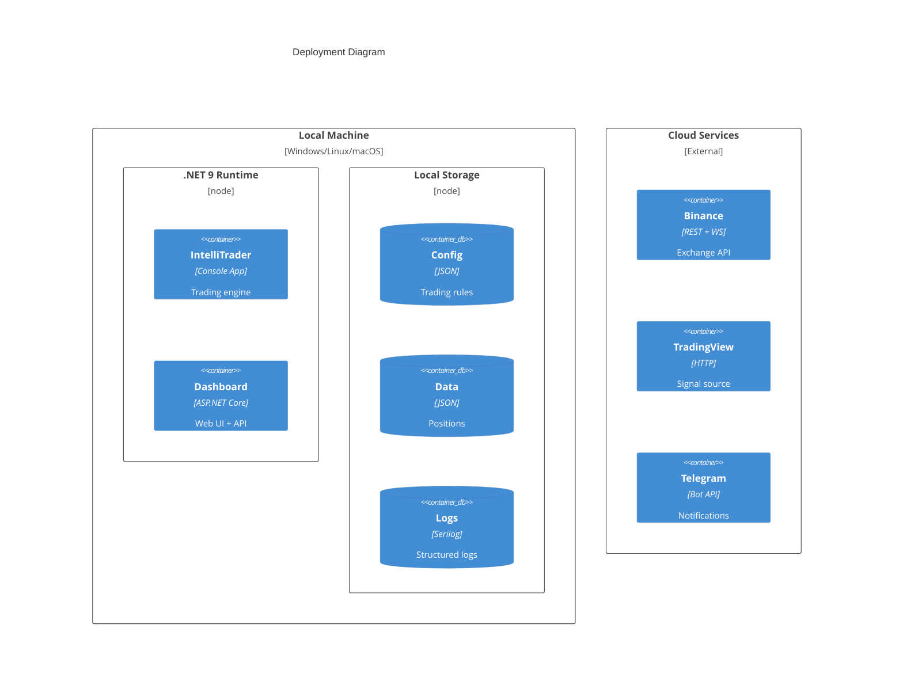

<div align="center">

# ⚡ IntelliTrader

### Algorithmic Crypto Trading That Never Sleeps

[](https://dotnet.microsoft.com/)
[](https://github.com/blackms/IntelliTrader/actions)
[](https://github.com/blackms/IntelliTrader)
[](https://codecov.io)
[](LICENSE.txt)
[](https://github.com/blackms/IntelliTrader/releases/latest)
[](https://ghcr.io/blackms/intellitrader)
[](https://github.com/blackms/IntelliTrader)
[](https://www.codefactor.io)

<br />

**Trade smarter. Execute faster. Sleep better.**

<br />

[Getting Started](#-getting-started) • [Features](#-features) • [Architecture](#-architecture) • [API](#-api-overview) • [Roadmap](#-roadmap)

<br />


</div>

<br />

## 🎯 Mission

IntelliTrader empowers traders with an autonomous, signal-driven trading engine that executes strategies 24/7. Built with modern .NET 9, designed for resilience, and architected for extensibility.

<br />

## 🛠 Tech Stack

<table>
<tr>
<td align="center" width="96">

<br /><strong>.NET 9</strong>
<br /><sub>Runtime</sub>
</td>
<td align="center" width="96">

<br /><strong>C# 13</strong>
<br /><sub>Language</sub>
</td>
<td align="center" width="96">

<br /><strong>Bootstrap 5</strong>
<br /><sub>UI</sub>
</td>
<td align="center" width="96">

<br /><strong>Docker</strong>
<br /><sub>Container</sub>
</td>
<td align="center" width="96">

<br /><strong>Actions</strong>
<br /><sub>CI/CD</sub>
</td>
</tr>
</table>

<table>
<tr>
<td align="center" width="96">
<strong>🔐</strong>
<br /><strong>Autofac</strong>
<br /><sub>IoC/DI</sub>
</td>
<td align="center" width="96">
<strong>🛡️</strong>
<br /><strong>Polly v8</strong>
<br /><sub>Resilience</sub>
</td>
<td align="center" width="96">
<strong>📡</strong>
<br /><strong>SignalR</strong>
<br /><sub>Real-time</sub>
</td>
<td align="center" width="96">
<strong>📊</strong>
<br /><strong>OpenTelemetry</strong>
<br /><sub>Observability</sub>
</td>
<td align="center" width="96">
<strong>⚡</strong>
<br /><strong>WebSocket</strong>
<br /><sub>Streaming</sub>
</td>
</tr>
<tr>
<td align="center" width="96">
<strong>📈</strong>
<br /><strong>TradingView</strong>
<br /><sub>Signals</sub>
</td>
<td align="center" width="96">
<strong>💹</strong>
<br /><strong>Binance</strong>
<br /><sub>Exchange</sub>
</td>
<td align="center" width="96">
<strong>📱</strong>
<br /><strong>Telegram</strong>
<br /><sub>Alerts</sub>
</td>
<td align="center" width="96">
<strong>🔒</strong>
<br /><strong>BCrypt</strong>
<br /><sub>Security</sub>
</td>
<td align="center" width="96">
<strong>✅</strong>
<br /><strong>FluentValidation</strong>
<br /><sub>Validation</sub>
</td>
</tr>
</table>

<br />

## ✨ Features

<table>
<tr>
<td>

**🔄 Trading Modes**
- Virtual paper trading
- Live exchange execution
- Seamless mode switching
- Async order execution

</td>
<td>

**📈 Order Types**
- Market orders
- Trailing buy/sell
- ATR-based dynamic stops
- Pair swapping

</td>
<td>

**💰 DCA Engine**
- 4+ configurable levels
- Margin-based triggers
- Kelly Criterion sizing
- Custom multipliers

</td>
</tr>
<tr>
<td>

**📊 Signal Intelligence**
- TradingView integration
- Multi-timeframe (5m→4h)
- WebSocket streaming
- Domain event dispatch

</td>
<td>

**⚙️ Rules Engine**
- Specification pattern
- Signal-based buy rules
- Sell/DCA trading rules
- Hot-reload config

</td>
<td>

**🛡️ Resilience**
- Circuit breakers
- Exponential backoff
- Bulkhead isolation
- Rate limiting

</td>
</tr>
<tr>
<td>

**🌐 Web Dashboard**
- SignalR real-time updates
- Manual controls
- P&L tracking
- REST + Minimal APIs

</td>
<td>

**📊 Observability**
- OpenTelemetry tracing
- Custom metrics
- Structured logging
- Health checks

</td>
<td>

**🏛️ Architecture**
- Clean Architecture
- CQRS pattern
- Domain Events
- Pure DI (no statics)

</td>
</tr>
</table>

<br />

## 🏗 Architecture

### System Overview


```mermaid
flowchart TB
    subgraph EXT["☁️ EXTERNAL SERVICES"]
        direction LR
        TV["📊 TradingView"]
        BN["💹 Binance<br/>REST + WebSocket"]
        TG["📱 Telegram"]
    end

    subgraph APP["📦 APPLICATION LAYER"]
        direction TB
        CMD["Commands<br/>Buy • Sell • Swap"]
        QRY["Queries<br/>Portfolio • Pairs"]
        DISP["Dispatchers<br/>Command • Query"]
    end

    subgraph DOMAIN["🎯 DOMAIN LAYER"]
        direction TB
        AGG["Aggregates<br/>Position • Portfolio"]
        EVT["Domain Events<br/>OrderPlaced • Filled"]
        SVC["Domain Services<br/>MarginCalc • Validation"]
    end

    subgraph INFRA["⚙️ INFRASTRUCTURE"]
        direction TB
        EXCH["Exchange Service<br/>+ Polly Resilience"]
        OTEL["OpenTelemetry<br/>Traces • Metrics"]
        PERSIST["Persistence<br/>JSON • Files"]
    end

    subgraph WEB["🌐 PRESENTATION"]
        direction TB
        HUB["SignalR Hub<br/>Real-time"]
        API["REST API<br/>+ Minimal APIs"]
        UI["Web Dashboard"]
    end

    TV -.->|"WebSocket"| INFRA
    BN <-->|"REST/WS"| EXCH
    TG <-.->|"Bot API"| INFRA

    WEB --> APP
    APP --> DOMAIN
    DOMAIN --> INFRA
    EVT -.->|"async"| HUB

    style EXT fill:#1a1a2e,stroke:#00d4ff,stroke-width:2px
    style APP fill:#16213e,stroke:#00ff88,stroke-width:2px
    style DOMAIN fill:#1a1a2e,stroke:#ffd93d,stroke-width:2px
    style INFRA fill:#0f3460,stroke:#ff6b6b,stroke-width:2px
    style WEB fill:#16213e,stroke:#00d4ff,stroke-width:2px
```

### CQRS & Domain Events Flow


```mermaid
sequenceDiagram
    autonumber
    participant UI as 🌐 Dashboard
    participant CMD as CommandDispatcher
    participant HDL as BuyOrderHandler
    participant SVC as TradingService
    participant EVT as EventDispatcher
    participant HUB as SignalR Hub

    rect rgb(26, 26, 46)
    note over UI,CMD: Command Dispatch
    UI->>CMD: PlaceBuyOrderCommand
    CMD->>HDL: Dispatch to handler
    end

    rect rgb(22, 33, 62)
    note over HDL,SVC: Business Logic
    HDL->>HDL: Validate command
    HDL->>SVC: BuyAsync()
    SVC->>SVC: Place order via Polly
    end

    rect rgb(15, 52, 96)
    note over SVC,HUB: Event-Driven Updates
    SVC->>EVT: Raise OrderPlacedEvent
    EVT-->>HUB: Dispatch async
    HUB-->>UI: Push notification
    end
```

### Resilience Pipeline


```mermaid
flowchart LR
    subgraph PIPELINE["🛡️ POLLY RESILIENCE PIPELINE"]
        direction LR
        TO["⏱️ Timeout<br/>30s read / 15s order"]
        BH["📦 Bulkhead<br/>10 concurrent"]
        CB["🔌 Circuit Breaker<br/>50% failure → open"]
        RT["🔄 Retry<br/>3x read / 1x order"]
    end

    REQ["API Request"] --> TO
    TO --> BH
    BH --> CB
    CB --> RT
    RT --> API["Binance API"]

    style PIPELINE fill:#1a1a2e,stroke:#00ff88,stroke-width:2px
```

### Clean Architecture Layers


```mermaid
graph TB
    subgraph PRESENTATION["🌐 Presentation"]
        WEB["Web Controllers"]
        HUB["SignalR Hubs"]
        MINI["Minimal APIs"]
    end

    subgraph APPLICATION["📦 Application"]
        CMD["Commands"]
        QRY["Queries"]
        HDL["Handlers"]
        PRT["Ports"]
    end

    subgraph DOMAIN["🎯 Domain"]
        ENT["Entities"]
        VAL["Value Objects"]
        AGG["Aggregates"]
        EVT["Domain Events"]
        SPC["Specifications"]
    end

    subgraph INFRASTRUCTURE["⚙️ Infrastructure"]
        EXC["Exchange Adapters"]
        PST["Persistence"]
        TEL["Telemetry"]
        MSG["Messaging"]
    end

    PRESENTATION --> APPLICATION
    APPLICATION --> DOMAIN
    INFRASTRUCTURE --> APPLICATION
    INFRASTRUCTURE -.->|"implements"| PRT

    style PRESENTATION fill:#16213e,stroke:#00d4ff
    style APPLICATION fill:#1a1a2e,stroke:#00ff88
    style DOMAIN fill:#0f3460,stroke:#ffd93d
    style INFRASTRUCTURE fill:#1a1a2e,stroke:#ff6b6b
```

### Deployment View


```mermaid
C4Deployment
    title Deployment Diagram

    Deployment_Node(local, "Local Machine", "Windows/Linux/macOS") {
        Deployment_Node(runtime, ".NET 9 Runtime") {
            Container(bot, "IntelliTrader", "Console App", "Trading engine")
            Container(web, "Dashboard", "ASP.NET Core", "Web UI + API")
        }
        Deployment_Node(storage, "Local Storage") {
            ContainerDb(cfg, "Config", "JSON", "Trading rules")
            ContainerDb(data, "Data", "JSON", "Positions")
            ContainerDb(logs, "Logs", "Serilog", "Structured logs")
        }
    }

    Deployment_Node(cloud, "Cloud Services", "External") {
        Container(binance, "Binance", "REST + WS", "Exchange API")
        Container(tv, "TradingView", "HTTP", "Signal source")
        Container(tg, "Telegram", "Bot API", "Notifications")
    }
```

<br />

## 🚀 Getting Started

### Prerequisites

| Requirement | Version | Notes |
|:------------|:--------|:------|
| .NET SDK | **9.0+** | [Download](https://dotnet.microsoft.com/download) |
| Binance Account | — | For live trading |
| TradingView | Free tier | Signal source |

### Quick Start

```bash
# Clone repository
git clone https://github.com/blackms/IntelliTrader.git
cd IntelliTrader

# Restore & build
dotnet restore
dotnet build

# Run (virtual trading mode)
dotnet run --project IntelliTrader
```

### Access Dashboard

```
http://localhost:7000
```

### Enable Live Trading

```bash
# 1. Encrypt API keys
dotnet run --project IntelliTrader -- \
  --encrypt --path keys.bin \
  --publickey YOUR_API_KEY \
  --privatekey YOUR_API_SECRET

# 2. Update config/trading.json
#    Set "VirtualTrading": false
```

### Running with Docker

A multi-stage `Dockerfile` is provided for production-grade containerized deployments. The final image is based on `mcr.microsoft.com/dotnet/aspnet:9.0-alpine`, runs as a non-root user, and stays under 200 MB.

```bash
# Build the image
docker build -t intellitrader:latest .

# Run with named volumes for config, data, and logs
docker run -d \
  --name intellitrader \
  -p 7000:7000 \
  -v intellitrader-config:/app/config \
  -v intellitrader-data:/app/data \
  -v intellitrader-log:/app/log \
  intellitrader:latest
```

**Volumes**

| Path | Purpose |
|---|---|
| `/app/config` | Trading rules, exchange, signals, and web configuration (overrides the baked-in baseline) |
| `/app/data` | Persisted runtime state (positions, snapshots) |
| `/app/log` | Serilog output |

**Live trading inside Docker** — bind-mount an encrypted `keys.bin` at runtime instead of baking it into the image:

```bash
docker run -d \
  --name intellitrader \
  -p 7000:7000 \
  -v $PWD/keys.bin:/app/keys.bin:ro \
  -v intellitrader-config:/app/config \
  -v intellitrader-data:/app/data \
  -v intellitrader-log:/app/log \
  intellitrader:latest
```

**Healthcheck** — the container exposes a Docker `HEALTHCHECK` that polls `GET /api/health` every 30 seconds. The endpoint is anonymous and returns `200 OK` whenever the web host is running, so `docker inspect` / orchestrators can reliably detect liveness.

### Running with docker compose

A `docker-compose.yml` is provided alongside a `docker-compose.override.yml` for local development. Compose merges them automatically.

```bash
# 1. Copy the sample env file and tweak host port / image tag if needed
cp .env.example .env

# 2. Build (first run only) and start in the background
docker compose up -d

# 3. Tail logs
docker compose logs -f

# 4. Stop and remove containers (volumes persist)
docker compose down
```

**Production-like vs development**

| | `docker-compose.yml` (base) | `+ docker-compose.override.yml` (default) |
|---|---|---|
| `ASPNETCORE_ENVIRONMENT` | `Production` | `Development` |
| Config bind mount | read-only | read-write |
| Log directory | named volume `intellitrader-log` | bind to `./IntelliTrader/log` |
| Healthcheck | every 30s | every 10s |

To run with the production-like base only (skipping the dev override):

```bash
docker compose -f docker-compose.yml up -d
```

**Live trading inside compose** — drop an encrypted `keys.bin` next to `docker-compose.yml` and uncomment the corresponding bind mount in the file. The same encryption command shown above for plain Docker applies.

### Deploying to Kubernetes with Helm

A Helm chart is provided under `deploy/helm/intellitrader/`.

```bash
# Install (virtual trading, default values)
helm install intellitrader deploy/helm/intellitrader

# Install with custom config overrides
helm install intellitrader deploy/helm/intellitrader \
  --set image.repository=ghcr.io/blackms/intellitrader \
  --set image.tag=v1.0.0 \
  --set-file config.files.trading\\.json=./my-trading.json

# Check the deployment
kubectl get pods -l app.kubernetes.io/name=intellitrader
kubectl logs -f deployment/intellitrader

# Upgrade
helm upgrade intellitrader deploy/helm/intellitrader --reuse-values

# Uninstall
helm uninstall intellitrader
```

The chart includes Deployment, Service, ConfigMap, Secret, PVC, Ingress (optional), HPA (optional), and ServiceAccount templates. Liveness and readiness probes point at `/health/live` and `/health/ready` respectively. See `deploy/helm/intellitrader/values.yaml` for the full set of configurable parameters.

> **Note**: IntelliTrader is a stateful singleton — the HPA defaults to `maxReplicas: 1`. Do not scale beyond 1 without external state coordination.

### Environment Variable Configuration

All JSON configuration settings can be overridden via environment variables, following [12-factor app](https://12factor.net/config) principles. Environment variables **take precedence** over values in JSON config files.

**Naming convention:**

```
INTELLITRADER_{Section}__{Key}
INTELLITRADER_{Section}__{NestedObject}__{Key}
```

The prefix `INTELLITRADER_` is stripped automatically. Double underscores (`__`) map to the `:` hierarchy separator used by .NET Configuration (this is standard `Microsoft.Extensions.Configuration` behavior).

**Examples:**

| JSON path | Environment variable |
|---|---|
| `core.json` > `Core.DebugMode` | `INTELLITRADER_Core__DebugMode=false` |
| `core.json` > `Core.InstanceName` | `INTELLITRADER_Core__InstanceName=Prod` |
| `trading.json` > `Trading.Enabled` | `INTELLITRADER_Trading__Enabled=true` |
| `trading.json` > `Trading.VirtualTrading` | `INTELLITRADER_Trading__VirtualTrading=false` |
| `trading.json` > `Trading.Market` | `INTELLITRADER_Trading__Market=USDT` |
| `exchange.json` > `Exchange.KeysPath` | `INTELLITRADER_Exchange__KeysPath=/secrets/keys.bin` |

This works with `docker run -e`, `docker compose` environment blocks, Kubernetes `env` specs, and `.env` files. See `.env.example` for a full list of documented overrides.

<br />

## 🔌 API Overview

### REST Endpoints

| Method | Endpoint | Description |
|:------:|:---------|:------------|
| `GET` | `/api/status` | Bot status, balance, health |
| `GET` | `/api/signal-names` | Available signal sources |
| `GET` | `/api/health` | Health check endpoint |
| `POST` | `/api/trading-pairs` | Active positions |
| `POST` | `/api/market-pairs` | Market data + signals |

### Trading Operations

| Method | Endpoint | Description |
|:------:|:---------|:------------|
| `POST` | `/Buy` | Manual buy order |
| `POST` | `/Sell` | Manual sell order |
| `POST` | `/Swap` | Swap position |
| `POST` | `/Settings` | Update runtime settings |

### SignalR Hub

```javascript
// Connect to real-time updates
const connection = new signalR.HubConnectionBuilder()
    .withUrl("/tradingHub")
    .withAutomaticReconnect()
    .build();

// Subscribe to events
connection.on("StatusUpdate", (status) => { /* ... */ });
connection.on("TradingPairsUpdate", (pairs) => { /* ... */ });
connection.on("OrderPlaced", (order) => { /* ... */ });
```

<br />

## 📍 Roadmap

| Priority | Task | Status |
|:--------:|:-----|:------:|
| `P1` | ~~.NET 9 migration~~ | ✅ Done |
| `P1` | ~~Pure DI (remove static locator)~~ | ✅ Done |
| `P1` | ~~Polly resilience patterns~~ | ✅ Done |
| `P1` | ~~Domain events~~ | ✅ Done |
| `P1` | ~~CQRS architecture~~ | ✅ Done |
| `P1` | ~~Async throughout~~ | ✅ Done |
| `P2` | Multi-exchange support (Kraken, Coinbase) | 🔲 Planned |
| `P2` | PostgreSQL persistence option | 🔲 Planned |
| `P2` | Event sourcing for positions | 🔬 Research |
| `P2` | ML-enhanced signal analysis | 🔬 Research |
| `P3` | Kubernetes Helm chart | 📋 Backlog |
| `P3` | GraphQL API layer | 📋 Backlog |
| `P3` | Strategy marketplace | 📋 Backlog |

<br />

## 🤝 Contributing

1. **Fork** the repository
2. **Create** feature branch: `git checkout -b feat/amazing-feature`
3. **Commit** with conventional commits: `feat:`, `fix:`, `docs:`
4. **Test** changes: `dotnet test` (1,010 tests must pass)
5. **Push** to fork: `git push origin feat/amazing-feature`
6. **Open** Pull Request

```bash
# Development commands
dotnet restore                              # Install dependencies
dotnet test                                 # Run all 1,010 tests
dotnet test --collect:"XPlat Code Coverage" # Run with coverage
dotnet build -c Release                     # Build for release
```

<br />

## ⚠️ Disclaimer

> **Trading cryptocurrency involves substantial risk of loss.** This software is provided "AS IS" without warranties. You are solely responsible for trading decisions and potential losses. Always start with virtual trading mode.

<br />

## 📄 License

**CC-BY-NC-SA-4.0** — Creative Commons Attribution-NonCommercial-ShareAlike 4.0

[](https://creativecommons.org/licenses/by-nc-sa/4.0/)

- Non-commercial use only
- Attribution required
- Share-alike for derivatives

<br />

---

<div align="center">

**[Documentation](docs/)** • **[Report Bug](https://github.com/blackms/IntelliTrader/issues)** • **[Request Feature](https://github.com/blackms/IntelliTrader/issues)**

<br />

Built with 💜 for the trading community

<br />

[⬆ Back to Top](#-intellitrader)

</div>
