<div align="center">

# ⚡ IntelliTrader

### Algorithmic Crypto Trading That Never Sleeps

[](https://dotnet.microsoft.com/)
[](https://github.com/blackms/IntelliTrader/actions)
[](https://codecov.io)
[](LICENSE.txt)
[](Dockerfile)
[](https://github.com/blackms/IntelliTrader)
[](https://www.codefactor.io)

<br />

**Trade smarter. Execute faster. Sleep better.**

<br />

[Getting Started](#-getting-started) &nbsp;&bull;&nbsp; [Features](#-features) &nbsp;&bull;&nbsp; [Architecture](#-architecture) &nbsp;&bull;&nbsp; [API](#-api-overview) &nbsp;&bull;&nbsp; [Roadmap](#-roadmap)

<br />


</div>

<br />

## 🎯 Mission

IntelliTrader empowers traders with an autonomous, signal-driven trading engine that executes strategies 24/7. Built for performance, designed for control.

<br />

## 🛠 Tech Stack

<table>
<tr>
<td align="center" width="96">

<br /><strong>.NET 8</strong>
</td>
<td align="center" width="96">

<br /><strong>C# 12</strong>
</td>
<td align="center" width="96">

<br /><strong>Bootstrap</strong>
</td>
<td align="center" width="96">

<br /><strong>Docker</strong>
</td>
<td align="center" width="96">

<br /><strong>Actions</strong>
</td>
</tr>
</table>

<table>
<tr>
<td align="center" width="96">
<strong>🔐</strong>
<br /><strong>Autofac</strong>
<br /><sub>IoC/DI</sub>
</td>
<td align="center" width="96">
<strong>🔄</strong>
<br /><strong>Polly</strong>
<br /><sub>Resilience</sub>
</td>
<td align="center" width="96">
<strong>📊</strong>
<br /><strong>TradingView</strong>
<br /><sub>Signals</sub>
</td>
<td align="center" width="96">
<strong>💹</strong>
<br /><strong>Binance</strong>
<br /><sub>Exchange</sub>
</td>
<td align="center" width="96">
<strong>📱</strong>
<br /><strong>Telegram</strong>
<br /><sub>Alerts</sub>
</td>
</tr>
</table>

<br />

## ✨ Features

<table>
<tr>
<td>

**🔄 Trading Modes**
- Virtual paper trading
- Live exchange execution
- Seamless mode switching

</td>
<td>

**📈 Order Types**
- Market orders
- Trailing buy/sell
- Stop-loss protection
- Pair swapping

</td>
<td>

**💰 DCA Engine**
- 4+ configurable levels
- Margin-based triggers
- Custom multipliers

</td>
</tr>
<tr>
<td>

**📊 Signal Intelligence**
- TradingView integration
- Multi-timeframe (5m→4h)
- Volatility analysis

</td>
<td>

**⚙️ Rules Engine**
- Signal-based buy rules
- Sell/DCA trading rules
- Hot-reload config

</td>
<td>

**🌐 Web Dashboard**
- Real-time monitoring
- Manual controls
- P&L tracking

</td>
</tr>
</table>

<br />

## 🏗 Architecture

### System Overview

```mermaid
flowchart TB
    subgraph EXT["☁️ EXTERNAL SERVICES"]
        direction LR
        TV["📊 TradingView"]
        BN["💹 Binance"]
        TG["📱 Telegram"]
    end

    subgraph ENGINE["⚡ TRADING ENGINE"]
        direction TB
        SIG["Signals Service"]
        RULES["Rules Engine"]
        TRADE["Trading Service"]
        EXCH["Exchange Service"]

        SIG --> RULES
        RULES --> TRADE
        TRADE --> EXCH
    end

    subgraph DATA["💾 PERSISTENCE"]
        direction LR
        CFG[("Config")]
        POS[("Positions")]
        LOG[("Logs")]
    end

    subgraph WEB["🌐 DASHBOARD"]
        API["REST API"]
        UI["Web UI"]
        UI --> API
    end

    TV -.->|"7s"| SIG
    EXCH <-->|"REST/WS"| BN
    TRADE -.->|"alerts"| TG

    CFG --> ENGINE
    TRADE --> POS
    TRADE --> LOG

    API --> ENGINE

    style EXT fill:#1a1a2e,stroke:#00d4ff,stroke-width:2px
    style ENGINE fill:#16213e,stroke:#00ff88,stroke-width:2px
    style DATA fill:#0f3460,stroke:#ff6b6b,stroke-width:2px
    style WEB fill:#1a1a2e,stroke:#ffd93d,stroke-width:2px
```



### Signal Processing Pipeline


### Domain Model


### Deployment Architecture

```mermaid
graph TB
    subgraph LOCAL["🖥️ LOCAL DEPLOYMENT"]
        subgraph RUNTIME[".NET 8 Runtime"]
            BOT["⚡ IntelliTrader<br/>Console App"]
            WEB["🌐 Dashboard<br/>:7000"]
        end
        subgraph STORAGE["Local Storage"]
            CFG["⚙️ config/*.json"]
            DATA["📊 data/"]
            LOGS["📝 logs/"]
        end
    end

    subgraph CLOUD["☁️ CLOUD SERVICES"]
        BINANCE["💹 Binance API<br/>REST + WebSocket"]
        TRADINGVIEW["📊 TradingView<br/>Signal Scanner"]
        TELEGRAM["📱 Telegram<br/>Bot API"]
    end

    BOT <--> BINANCE
    BOT --> TRADINGVIEW
    BOT --> TELEGRAM
    BOT <--> CFG
    BOT <--> DATA
    BOT --> LOGS
    WEB --> BOT

    style LOCAL fill:#0d1117,stroke:#30363d,stroke-width:2px
    style CLOUD fill:#161b22,stroke:#30363d,stroke-width:2px
    style RUNTIME fill:#21262d,stroke:#00d4ff,stroke-width:1px
    style STORAGE fill:#21262d,stroke:#ff6b6b,stroke-width:1px
```



<br />

## 🚀 Getting Started

### Prerequisites

| Requirement | Version |
|:------------|:--------|
| .NET SDK | 8.0+ |
| Binance Account | For live trading |
| TradingView | Free tier works |

### Installation

```bash
# Clone repository
git clone https://github.com/blackms/IntelliTrader.git
cd IntelliTrader

# Build solution
dotnet build IntelliTrader.sln

# Run (virtual trading mode)
dotnet run --project IntelliTrader
```

### Access Dashboard

```
http://localhost:7000
```

### Enable Live Trading

```bash
# 1. Encrypt API keys
dotnet run --project IntelliTrader -- \
  --encrypt --path keys.bin \
  --publickey YOUR_API_KEY \
  --privatekey YOUR_API_SECRET

# 2. Update config/trading.json
#    Set "VirtualTrading": false
```

<br />

## 🔌 API Overview

### Status

| Method | Endpoint | Description |
|:------:|:---------|:------------|
| `GET` | `/Status` | Bot status, balance, health |
| `GET` | `/SignalNames` | Available signal sources |
| `GET` | `/RefreshAccount` | Sync with exchange |

### Trading

| Method | Endpoint | Description |
|:------:|:---------|:------------|
| `POST` | `/Buy` | Manual buy order |
| `POST` | `/Sell` | Manual sell order |
| `POST` | `/Swap` | Swap position |
| `POST` | `/TradingPairs` | Active positions |
| `POST` | `/MarketPairs` | Market data + signals |

### Configuration

| Method | Endpoint | Description |
|:------:|:---------|:------------|
| `POST` | `/Settings` | Update runtime settings |
| `POST` | `/SaveConfig` | Persist configuration |
| `GET` | `/RestartServices` | Restart all services |

<br />

## 📍 Roadmap

| Priority | Task | Status |
|:--------:|:-----|:------:|
| `P1` | Multi-exchange support (Kraken, Coinbase) | 🔲 Planned |
| `P1` | PostgreSQL persistence option | 🔲 Planned |
| `P1` | Docker Compose deployment | 🔄 In Progress |
| `P2` | GraphQL API layer | 🔲 Planned |
| `P2` | ML-enhanced signal analysis | 🔬 Research |
| `P2` | Mobile companion app | 🔲 Planned |
| `P3` | Kubernetes Helm chart | 📋 Backlog |
| `P3` | Social trading features | 📋 Backlog |
| `P3` | Strategy marketplace | 📋 Backlog |

<br />

## 🤝 Contributing

1. **Fork** the repository
2. **Create** feature branch: `git checkout -b feat/amazing-feature`
3. **Commit** with conventional commits: `feat:`, `fix:`, `docs:`
4. **Test** changes: `dotnet test`
5. **Push** to fork: `git push origin feat/amazing-feature`
6. **Open** Pull Request

```bash
# Development commands
dotnet restore                              # Install dependencies
dotnet test --collect:"XPlat Code Coverage" # Run tests with coverage
dotnet build -c Release                     # Build for release
```

<br />

## ⚠️ Disclaimer

> **Trading cryptocurrency involves substantial risk of loss.** This software is provided "AS IS" without warranties. You are solely responsible for trading decisions and potential losses. Always start with virtual trading mode.

<br />

## 📄 License

**CC-BY-NC-SA-4.0** — Creative Commons Attribution-NonCommercial-ShareAlike 4.0

[](https://creativecommons.org/licenses/by-nc-sa/4.0/)

- Non-commercial use only
- Attribution required
- Share-alike for derivatives

<br />

---

<div align="center">

**[Documentation](docs/)** &nbsp;&bull;&nbsp; **[Report Bug](https://github.com/blackms/IntelliTrader/issues)** &nbsp;&bull;&nbsp; **[Request Feature](https://github.com/blackms/IntelliTrader/issues)**

<br />

Built with 💜 for the trading community

<br />

[⬆ Back to Top](#-intellitrader)

</div>
