# IntelliTrader Architecture Documentation

> Comprehensive architecture reference for the IntelliTrader cryptocurrency trading bot

**Version:** 0.9.9.2
**Target Framework:** .NET 9.0
**Last Updated:** January 2025

---

## Table of Contents

1. [Solution Overview](#solution-overview)
2. [Component Catalog](#component-catalog)
3. [Dependency Graph](#dependency-graph)
4. [Entrypoints and Runtime Modes](#entrypoints-and-runtime-modes)
5. [Data Flow Overview](#data-flow-overview)
6. [Service Architecture](#service-architecture)
7. [Configuration System](#configuration-system)

---

## Solution Overview

IntelliTrader is a modular cryptocurrency trading bot designed for the Binance exchange. The solution follows a layered architecture with clear separation of concerns:

- **Domain-Driven Design (DDD)** patterns in the Domain layer
- **Hexagonal Architecture (Ports and Adapters)** in the Application layer
- **Plugin Architecture** via Autofac module auto-discovery
- **CQRS** pattern for command/query separation

```
IntelliTrader.sln
|
+-- IntelliTrader/                    # Main executable (entry point)
+-- IntelliTrader.Core/               # Core services, interfaces, configuration
+-- IntelliTrader.Domain/             # Domain entities, value objects, events
+-- IntelliTrader.Application/        # Use cases, commands, queries, ports
+-- IntelliTrader.Infrastructure/     # Adapters, dispatchers, telemetry
+-- IntelliTrader.Trading/            # Trading operations, position sizing
+-- IntelliTrader.Rules/              # Rule engine, specifications
+-- IntelliTrader.Signals.Base/       # Signal service abstraction
+-- IntelliTrader.Signals.TradingView/ # TradingView signal receiver
+-- IntelliTrader.Exchange.Base/      # Exchange abstraction layer
+-- IntelliTrader.Exchange.Binance/   # Binance implementation with Polly resilience
+-- IntelliTrader.Web/                # ASP.NET Core dashboard, SignalR
+-- IntelliTrader.Backtesting/        # Historical replay engine
```

---

## Component Catalog

### IntelliTrader (Main Executable)

**Purpose:** Application entry point and composition root

| File | Description |
|------|-------------|
| `Program.cs` | Entry point, container building, key encryption CLI |

**Key Responsibilities:**
- Parse command-line arguments
- Build Autofac DI container via `ApplicationBootstrapper`
- Start `ICoreService` which orchestrates all services
- Provide key encryption utility for secure API credential storage

---

### IntelliTrader.Core

**Purpose:** Foundation layer with core services, interfaces, and configuration

#### Services

| Service | Interface | Description |
|---------|-----------|-------------|
| `CoreService` | `ICoreService` | Orchestrator for all services and timed tasks |
| `LoggingService` | `ILoggingService` | Serilog-based logging with memory sink |
| `NotificationService` | `INotificationService` | Telegram notification integration |
| `HealthCheckService` | `IHealthCheckService` | Health monitoring and status tracking |
| `CachingService` | `ICachingService` | In-memory caching with refresh |
| `ConfigProvider` | `IConfigProvider` | JSON configuration management with hot-reload |
| `ApplicationBootstrapper` | `IApplicationBootstrapper` | DI container builder with module discovery |
| `ApplicationContext` | `IApplicationContext` | Runtime context (speed multiplier for backtesting) |

#### Timed Tasks

| Task | Interval | Description |
|------|----------|-------------|
| `HealthCheckTimedTask` | Configurable | Monitors service health, triggers trading suspension |
| `HighResolutionTimedTask` | Base class | High-frequency polling task infrastructure |
| `LowResolutionTimedTask` | Base class | Lower-frequency task infrastructure |

#### Key Models

| Model | Description |
|-------|-------------|
| `BuyOptions` / `SellOptions` / `SwapOptions` | Trading operation parameters |
| `TradeResult` | Result of a trading operation |
| `DCALevel` | Dollar-cost averaging level configuration |
| `BoundedConcurrentStack<T>` | Thread-safe collection with automatic pruning |

#### Configuration Models

| Config | File | Description |
|--------|------|-------------|
| `CoreConfig` | `core.json` | Health check settings, instance name |
| `TradingConfig` | `trading.json` | Market, exchange, buy/sell parameters |
| `SignalsConfig` | `signals.json` | Signal definitions and receivers |
| `RulesConfig` | `rules.json` | Signal and trading rules |
| `NotificationConfig` | `notification.json` | Telegram settings |
| `CachingConfig` | `caching.json` | Cache TTL settings |
| `LoggingConfig` | `logging.json` | Serilog configuration |
| `WebConfig` | `web.json` | Dashboard port and authentication |
| `BacktestingConfig` | `backtesting.json` | Replay settings |

#### External Packages

| Package | Version | Purpose |
|---------|---------|---------|
| Autofac | 8.1.1 | Dependency injection container |
| Serilog | 4.1.0 | Structured logging |
| Serilog.Sinks.Console | 6.0.0 | Console logging |
| Serilog.Sinks.File | 6.0.0 | File logging |
| Telegram.Bot | 22.0.0 | Telegram notifications |
| FluentValidation | 11.11.0 | Input validation |
| Microsoft.Extensions.Configuration | 9.0.0 | Configuration binding |

---

### IntelliTrader.Domain

**Purpose:** Domain entities, value objects, and domain events (DDD)

#### Aggregates

| Aggregate | Description |
|-----------|-------------|
| `Position` | Trading position with entries, margin, and P&L tracking |
| `Portfolio` | Collection of positions with balance management |

#### Value Objects

| Value Object | Description |
|--------------|-------------|
| `TradingPair` | Immutable trading pair identifier |
| `Money` | Currency amount with proper decimal handling |
| `Price` | Price point with validation |
| `Quantity` | Order quantity with validation |
| `Margin` | Position margin percentage |
| `SignalRating` | Signal strength rating (-1 to 1) |
| `PositionId` / `OrderId` / `PortfolioId` | Strongly-typed identifiers |

#### Domain Events

| Event | Description |
|-------|-------------|
| `OrderPlacedEvent` | Fired when an order is submitted |
| `OrderFilledEvent` | Fired when an order is filled |
| `PositionOpened` / `PositionClosed` | Position lifecycle events |
| `DCAExecuted` | Dollar-cost averaging executed |
| `StopLossTriggeredEvent` | Stop-loss order triggered |
| `TradingSuspendedEvent` / `TradingResumedEvent` | Trading state changes |
| `RiskLimitBreachedEvent` | Risk management threshold exceeded |
| `SignalReceivedEvent` | New signal received |

#### Domain Services

| Service | Description |
|---------|-------------|
| `RuleEvaluator` | Evaluates trading rules against context |
| `MarginCalculator` | Calculates position margins |
| `TradingConstraintValidator` | Validates trading constraints |

#### Specifications

| Specification | Description |
|---------------|-------------|
| `SignalSpecifications` | Signal-based trading conditions |
| `GlobalSpecifications` | Global market conditions |
| `PositionSpecifications` | Position-based conditions |

---

### IntelliTrader.Application

**Purpose:** Use cases, commands, queries, and ports (Hexagonal Architecture)

#### Commands

| Command | Handler | Description |
|---------|---------|-------------|
| `PlaceBuyOrderCommand` | `PlaceBuyOrderHandler` | Execute buy order |
| `PlaceSellOrderCommand` | `PlaceSellOrderHandler` | Execute sell order |
| `PlaceSwapOrderCommand` | `PlaceSwapOrderHandler` | Execute swap operation |
| `OpenPositionCommand` | `OpenPositionHandler` | Open new position |
| `ClosePositionCommand` | `ClosePositionHandler` | Close existing position |
| `ExecuteDCACommand` | `ExecuteDCAHandler` | Execute DCA operation |

#### Queries

| Query | Description |
|-------|-------------|
| `GetPortfolioStatusQuery` | Portfolio balance and positions |
| `GetTradingPairsQuery` | Active trading pairs |
| `PositionQueries` | Position data queries |
| `PortfolioQueries` | Portfolio data queries |

#### Driving Ports (Primary/Input)

| Port | Description |
|------|-------------|
| `ICommandDispatcher` | Dispatches commands to handlers |
| `IQueryDispatcher` | Dispatches queries to handlers |
| `ITradingUseCase` | Trading operation use case |
| `ISignalUseCase` | Signal processing use case |

#### Driven Ports (Secondary/Output)

| Port | Description |
|------|-------------|
| `IExchangePort` | Exchange operations abstraction |
| `IPositionRepository` | Position persistence |
| `IPortfolioRepository` | Portfolio persistence |
| `ISignalProviderPort` | Signal data provider |
| `INotificationPort` | Notification delivery |
| `IDomainEventDispatcher` | Domain event publishing |

#### Application Services

| Service | Description |
|---------|-------------|
| `TradingRuleProcessor` | Processes trading rules |
| `TrailingManager` | Manages trailing buy/sell states |

---

### IntelliTrader.Infrastructure

**Purpose:** Adapters, dispatchers, and cross-cutting concerns

#### Adapters

| Adapter | Port | Description |
|---------|------|-------------|
| `LegacyTradingServiceAdapter` | `ILegacyTradingServiceAdapter` | Bridges old `ITradingService` to new architecture |
| `BinanceExchangeAdapter` | `IExchangePort` | Binance API adapter |
| `TradingViewSignalAdapter` | `ISignalProviderPort` | TradingView signal adapter |
| `JsonPositionRepository` | `IPositionRepository` | JSON file persistence |

#### Dispatchers

| Dispatcher | Description |
|------------|-------------|
| `InMemoryCommandDispatcher` | Resolves and invokes command handlers |
| `InMemoryQueryDispatcher` | Resolves and invokes query handlers |
| `InMemoryDomainEventDispatcher` | Publishes domain events to handlers |

#### Background Services

| Service | Description |
|---------|-------------|
| `TradingRuleProcessorService` | Continuously evaluates trading rules |
| `OrderExecutionService` | Processes pending order queue |
| `SignalRuleProcessorService` | Evaluates signal rules for buy triggers |

#### Telemetry

| Component | Description |
|-----------|-------------|
| `TradingTelemetry` | OpenTelemetry metrics and traces |
| `TelemetryServiceCollectionExtensions` | DI registration helpers |

#### External Packages

| Package | Version | Purpose |
|---------|---------|---------|
| Autofac | 8.2.0 | Dependency injection |
| System.Reactive | 6.0.0 | Reactive extensions |
| OpenTelemetry | 1.9.0 | Observability |
| OpenTelemetry.Instrumentation.AspNetCore | 1.9.0 | ASP.NET Core tracing |
| OpenTelemetry.Instrumentation.Http | 1.9.0 | HTTP client tracing |

---

### IntelliTrader.Trading

**Purpose:** Trading operations, position sizing, and orchestration

#### Services

| Service | Interface | Description |
|---------|-----------|-------------|
| `TradingService` | `ITradingService` | Facade coordinating all trading operations |
| `BuyOrchestrator` | `IBuyOrchestrator` | Buy order execution with swap detection |
| `SellOrchestrator` | `ISellOrchestrator` | Sell order execution with trailing support |
| `SwapOrchestrator` | `ISwapOrchestrator` | Atomic sell-then-buy swap operations |
| `TrailingOrderManager` | `ITrailingOrderManager` | Manages trailing buy/sell states |
| `ATRCalculator` | `IATRCalculator` | Average True Range calculations |
| `DynamicStopLossManager` | `IDynamicStopLossManager` | ATR-based trailing stop-loss |
| `PortfolioRiskManager` | `IPortfolioRiskManager` | Aggregate risk management |

#### Position Sizing

| Sizer | Description |
|-------|-------------|
| `FixedPercentagePositionSizer` | Fixed percentage of balance |
| `KellyCriterionPositionSizer` | Kelly criterion optimal sizing |
| `PositionSizerFactory` | Factory for position sizers |

#### Account Models

| Model | Description |
|-------|-------------|
| `VirtualAccount` | Paper trading account |
| `ExchangeAccount` | Live exchange account |
| `TradingAccountBase` | Common account operations |
| `TradingPair` | Active position tracking |

---

### IntelliTrader.Rules

**Purpose:** Rule engine with specification pattern

#### Services

| Service | Interface | Description |
|---------|-----------|-------------|
| `RulesService` | `IRulesService` | Rule evaluation and management |

#### Models

| Model | Description |
|-------|-------------|
| `Rule` | Rule definition with conditions |
| `RuleCondition` | Individual rule condition |
| `ModuleRules` | Rules grouped by module |
| `RuleTrailing` | Trailing rule configuration |

#### Specifications

| Specification | Description |
|---------------|-------------|
| `RatingSpecification` | Signal rating conditions |
| `PriceSpecification` | Price-based conditions |
| `VolumeSpecification` | Volume conditions |
| `VolatilitySpecification` | Volatility conditions |
| `MarginSpecification` | Position margin conditions |
| `AgeSpecification` | Position age conditions |
| `DCALevelSpecification` | DCA level conditions |
| `GlobalRatingSpecification` | Global market rating |
| `PairsSpecification` | Pair inclusion/exclusion |
| `SignalRulesSpecification` | Signal rule evaluation |
| `AmountSpecification` | Amount conditions |
| `ConditionSpecificationBuilder` | Builds specifications from conditions |

---

### IntelliTrader.Signals.Base

**Purpose:** Signal service abstraction and base implementation

#### Services

| Service | Interface | Description |
|---------|-----------|-------------|
| `SignalsService` | `ISignalsService` | Aggregates signals from all receivers |

#### Interfaces

| Interface | Description |
|-----------|-------------|
| `ISignalReceiver` | Signal data receiver contract |
| `ISignal` | Signal data contract |
| `ISignalDefinition` | Signal definition contract |
| `ISignalTrailingInfo` | Trailing signal information |

---

### IntelliTrader.Signals.TradingView

**Purpose:** TradingView signal integration

#### Services

| Service | Description |
|---------|-------------|
| `TradingViewCryptoSignalReceiver` | TradingView API client |

#### Timed Tasks

| Task | Interval | Description |
|------|----------|-------------|
| `TradingViewCryptoSignalPollingTimedTask` | ~7s | Polls TradingView for signals |

---

### IntelliTrader.Exchange.Base

**Purpose:** Exchange abstraction layer

#### Models

| Model | Description |
|-------|-------------|
| `Ticker` | Price ticker data |
| `Order` | Order request model |
| `OrderDetails` | Filled order details |

#### External Packages

| Package | Version | Purpose |
|---------|---------|---------|
| DigitalRuby.ExchangeSharp | 1.2.1 | Exchange API library |

---

### IntelliTrader.Exchange.Binance

**Purpose:** Binance exchange implementation with resilience

#### Services

| Service | Description |
|---------|-------------|
| `BinanceExchangeService` | Binance API operations |
| `BinanceWebSocketService` | WebSocket ticker streaming |

#### Timed Tasks

| Task | Interval | Description |
|------|----------|-------------|
| `BinanceTickersMonitorTimedTask` | ~1s | Monitors WebSocket health |

#### Resilience

| Component | Description |
|-----------|-------------|
| `ExchangeResiliencePipelines` | Polly pipelines for retry, circuit breaker, rate limiting |
| `ResilienceConfig` | Resilience policy configuration |

#### External Packages

| Package | Version | Purpose |
|---------|---------|---------|
| Polly | 8.2.1 | Resilience and transient fault handling |
| Polly.RateLimiting | 8.2.1 | Rate limiting |
| Polly.Extensions | 8.2.1 | Polly DI extensions |

---

### IntelliTrader.Web

**Purpose:** ASP.NET Core dashboard with SignalR real-time updates

#### Controllers

| Controller | Description |
|------------|-------------|
| `HomeController` | Dashboard views (Market, Trades, Stats, Settings) |

#### SignalR

| Hub | Description |
|-----|-------------|
| `TradingHub` | Real-time trading updates |

#### Background Services

| Service | Description |
|---------|-------------|
| `SignalRBroadcasterService` | Pushes updates to connected clients |

#### Services

| Service | Interface | Description |
|---------|-----------|-------------|
| `WebService` | `IWebService` | Kestrel web host management |
| `PasswordService` | `IPasswordService` | BCrypt password hashing |
| `TradingHubNotifier` | `ITradingHubNotifier` | SignalR broadcast helper |

#### View Models

| ViewModel | Description |
|-----------|-------------|
| `DashboardViewModel` | Main dashboard data |
| `MarketViewModel` | Market overview |
| `TradesViewModel` | Trade history |
| `StatsViewModel` | Trading statistics |
| `SettingsViewModel` | Configuration display |
| `LogViewModel` | Log viewer |

#### External Packages

| Package | Version | Purpose |
|---------|---------|---------|
| BCrypt.Net-Next | 4.0.3 | Password hashing |
| OpenTelemetry | 1.9.0 | Observability |

---

### IntelliTrader.Backtesting

**Purpose:** Historical data replay engine

#### Services

| Service | Interface | Description |
|---------|-----------|-------------|
| `BacktestingService` | `IBacktestingService` | Backtesting orchestration |
| `BacktestingExchangeService` | `IExchangeService` | Replays historical ticker data |
| `BacktestingSignalsService` | `ISignalsService` | Replays historical signals |

#### Timed Tasks

| Task | Description |
|------|-------------|
| `BacktestingLoadSnapshotsTimedTask` | Loads snapshots during replay |
| `BacktestingSaveSnapshotsTimedTask` | Saves snapshots for future replay |

#### External Packages

| Package | Version | Purpose |
|---------|---------|---------|
| MessagePack | 2.5.187 | Binary serialization for snapshots |

---

## Dependency Graph

### Internal Project Dependencies

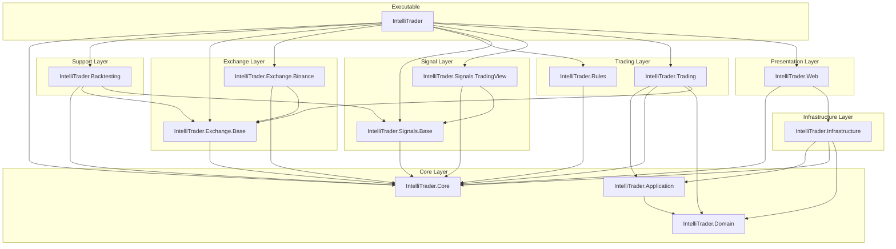

### External Package Dependencies

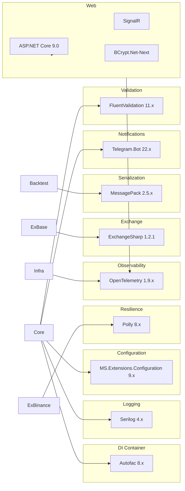

---

## Entrypoints and Runtime Modes

### Entry Point

The application starts in `IntelliTrader/Program.cs`:

```
Program.Main()
  |
  +-- ParseCommandLineArgs()
  |
  +-- [No args] --> StartCoreService()
  |                   |
  |                   +-- BuildAndConfigureContainer()
  |                   |     +-- ApplicationBootstrapper.BuildContainer()
  |                   |     +-- Auto-discover IntelliTrader.*.dll modules
  |                   |     +-- Register all AppModule classes
  |                   |
  |                   +-- ICoreService.Start()
  |                         +-- Start enabled services
  |                         +-- Start timed tasks
  |
  +-- [--encrypt] --> EncryptKeys()
                        +-- Encrypt API credentials to keys.bin
```

### Runtime Modes

#### 1. Live Trading Mode

**Configuration:**
```json
// trading.json
{
  "Trading": {
    "Enabled": true,
    "VirtualTrading": false,
    "Exchange": "Binance"
  }
}

// backtesting.json
{
  "Backtesting": {
    "Enabled": false
  }
}
```

**Behavior:**
- Connects to Binance via WebSocket for real-time ticker data
- Uses `ExchangeAccount` for actual balance and order execution
- Polly resilience policies protect against API failures
- Orders are executed on the live exchange

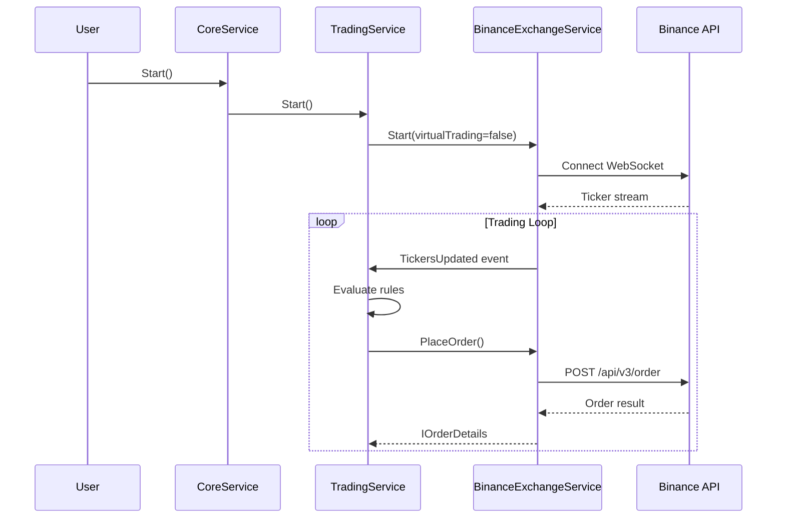

#### 2. Virtual Trading Mode (Paper Trading)

**Configuration:**
```json
// trading.json
{
  "Trading": {
    "Enabled": true,
    "VirtualTrading": true,
    "VirtualAccountInitialBalance": 0.12,
    "VirtualAccountFilePath": "data/virtual-account.json"
  }
}
```

**Behavior:**
- Connects to Binance for real-time ticker data (read-only)
- Uses `VirtualAccount` for simulated balance and orders
- No actual orders are placed on the exchange
- Account state persisted to JSON file

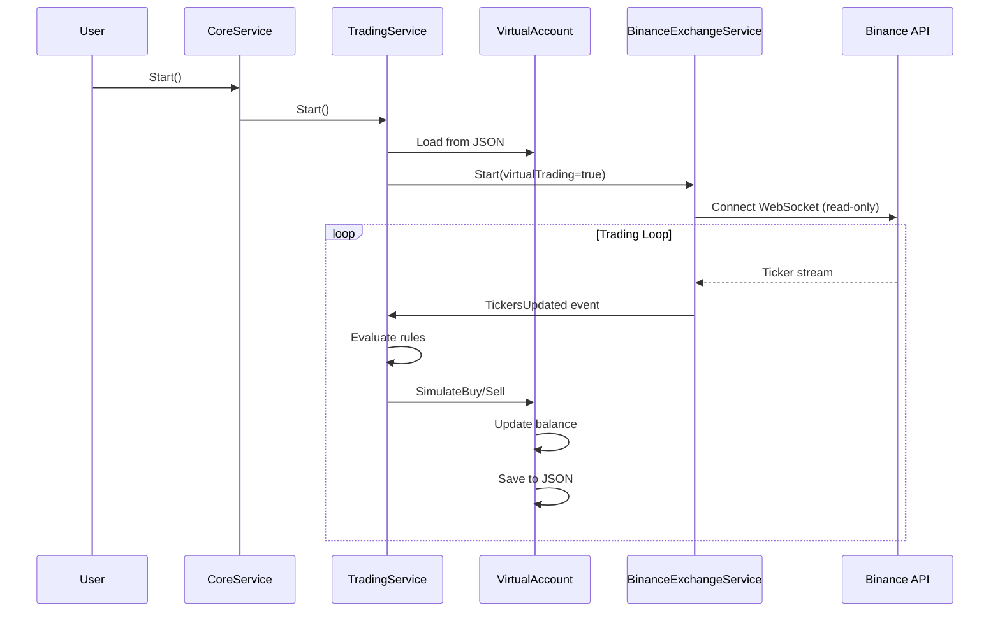

#### 3. Backtesting Mode (Snapshot Recording)

**Configuration:**
```json
// backtesting.json
{
  "Backtesting": {
    "Enabled": true,
    "Replay": false,
    "SnapshotsInterval": 1,
    "SnapshotsPath": "data/backtesting"
  }
}
```

**Behavior:**
- Records ticker and signal snapshots to MessagePack files
- Runs normal trading (virtual or live) while recording
- Snapshots stored for later replay

#### 4. Backtesting Mode (Replay)

**Configuration:**
```json
// backtesting.json
{
  "Backtesting": {
    "Enabled": true,
    "Replay": true,
    "ReplaySpeed": 250,
    "ReplayStartIndex": null,
    "ReplayEndIndex": null
  }
}
```

**Behavior:**
- Replaces `IExchangeService` with `BacktestingExchangeService`
- Replaces `ISignalsService` with `BacktestingSignalsService`
- Loads historical snapshots and replays them at configurable speed
- Uses `ApplicationContext.Speed` to accelerate time calculations
- Virtual account tracks simulated performance

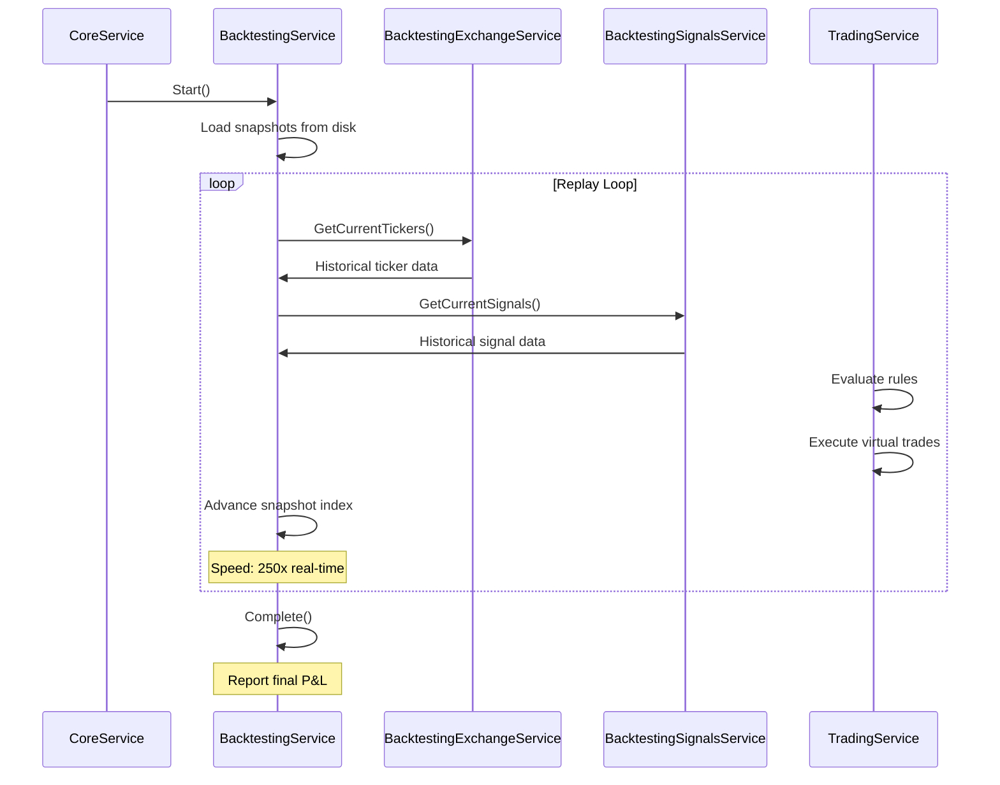

---

## Data Flow Overview

### Signal to Trade Execution Flow

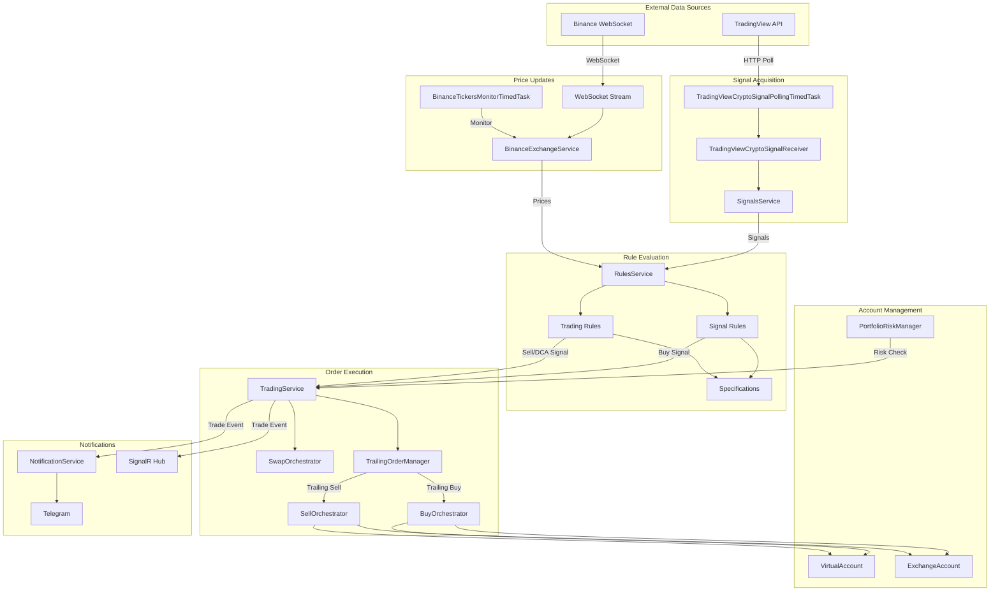

### Detailed Signal Processing Pipeline

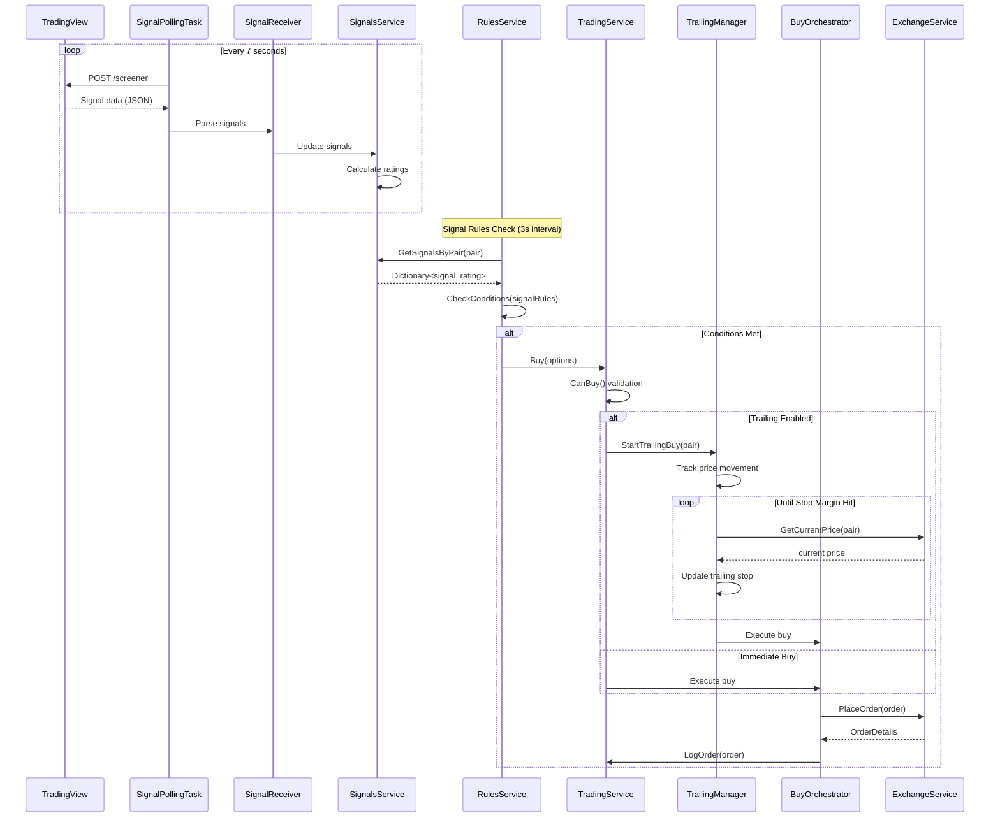

### Trading Rules Processing (Sell/DCA)

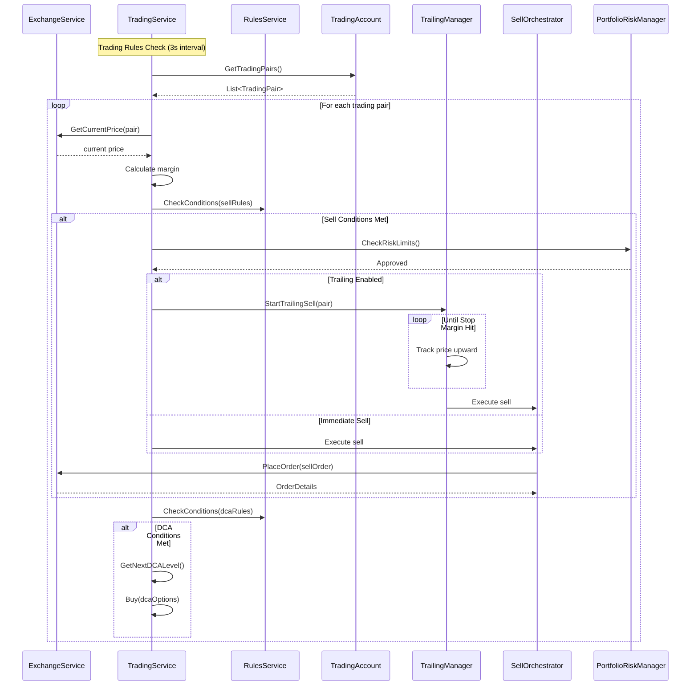

---

## Service Architecture

### Service Lifecycle

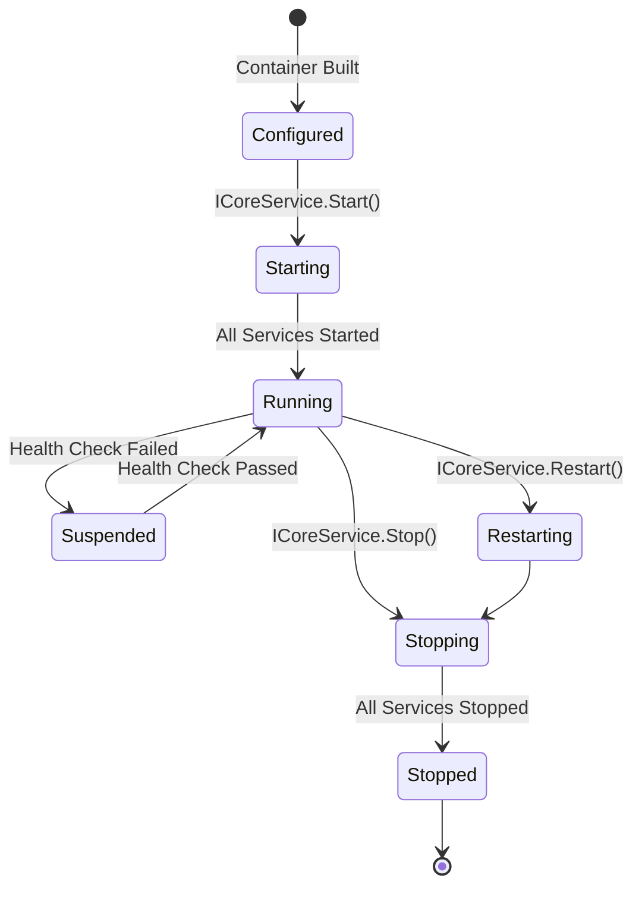

### Service Dependencies

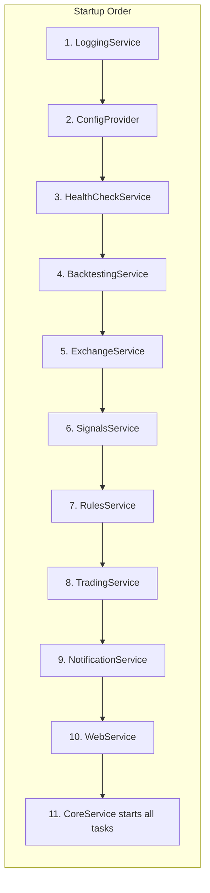

---

## Configuration System

### Configuration Files

| File | Hot-Reload | Description |
|------|------------|-------------|
| `core.json` | Yes | Core service settings |
| `trading.json` | Yes | Trading parameters |
| `signals.json` | Yes | Signal definitions |
| `rules.json` | Yes | Trading and signal rules |
| `exchange.json` | No | Exchange API settings |
| `web.json` | No | Web dashboard settings |
| `notification.json` | Yes | Telegram settings |
| `caching.json` | Yes | Cache TTL settings |
| `logging.json` | No | Serilog configuration |
| `backtesting.json` | No | Backtesting settings |

### Configuration Loading

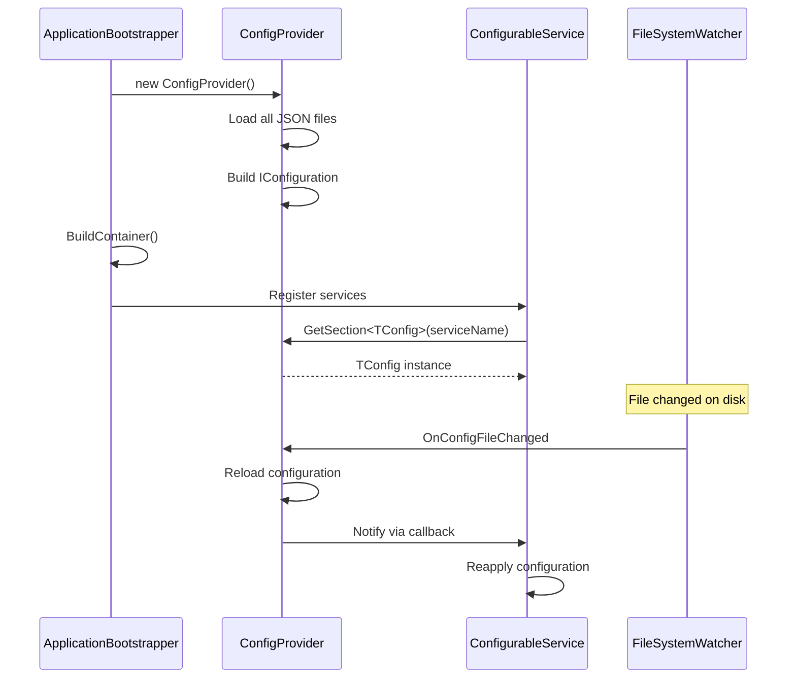

---

## Appendix

### Constants Reference

```csharp
public static class Constants
{
    public static class ServiceNames
    {
        public const string CoreService = "Core";
        public const string TradingService = "Trading";
        public const string SignalsService = "Signals";
        public const string RulesService = "Rules";
        public const string WebService = "Web";
        public const string BacktestingService = "Backtesting";
        // ... etc
    }

    public static class TimedTasks
    {
        public const int StandardDelay = 3000;      // 3s
        public const int DefaultIntervalMs = 1000;  // 1s
    }

    public static class WebSocket
    {
        public const int PingIntervalSeconds = 20;
        public const int ReconnectDelaySeconds = 5;
        public const int MaxReconnectAttempts = 5;
        public const int MaxTickersAgeSeconds = 60;
    }

    public static class Resilience
    {
        public const int DefaultReadTimeoutSeconds = 30;
        public const int DefaultOrderTimeoutSeconds = 15;
        public const int DefaultMaxConcurrentReads = 10;
        public const int DefaultMaxConcurrentOrders = 3;
        public const int DefaultRateLimitPermitsPerMinute = 1000;
    }
}
```

### Health Check Names

| Health Check | Description |
|--------------|-------------|
| `AccountRefreshed` | Account balance updated |
| `TickersUpdated` | Price data received |
| `TradingPairsProcessed` | Trading pairs evaluated |
| `TradingViewCryptoSignalsReceived` | Signals received |
| `SignalRulesProcessed` | Signal rules evaluated |
| `TradingRulesProcessed` | Trading rules evaluated |

---

*Document generated from IntelliTrader source code analysis*
