# IntelliTrader High-Level Design (HLD)

This document provides a comprehensive architectural overview of the IntelliTrader cryptocurrency trading bot system.

## Table of Contents

1. [System Context](#1-system-context)
2. [Container View](#2-container-view)
3. [Key Business Flows](#3-key-business-flows)
4. [Data Flow Diagram](#4-data-flow-diagram)
5. [Deployment View](#5-deployment-view)

---

## 1. System Context

IntelliTrader is a .NET Core cryptocurrency trading bot that integrates with external exchanges and signal providers to execute automated trading strategies.

### System Context Diagram (C4 Level 1)

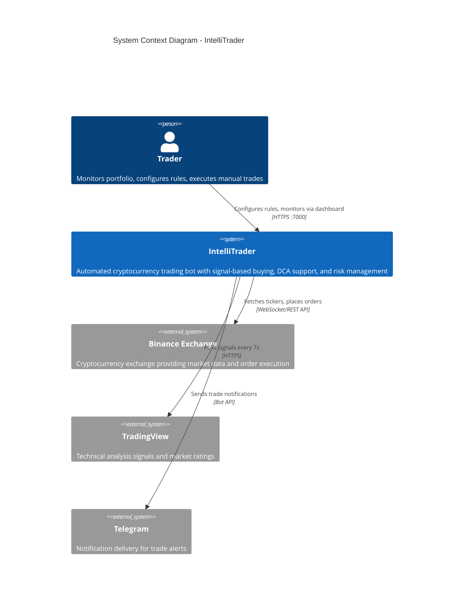

### Trust Boundaries

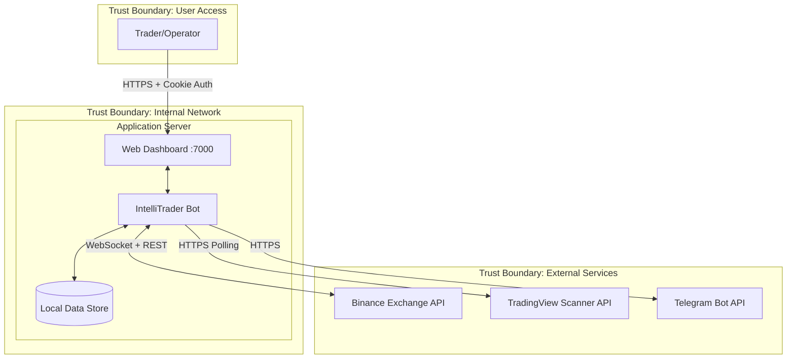

### External System Interactions

| External System | Protocol | Purpose | Authentication |
|----------------|----------|---------|----------------|
| Binance Exchange | WebSocket + REST | Real-time tickers, order placement | API Key/Secret (encrypted) |
| TradingView | HTTPS REST | Signal acquisition (ratings, volume, volatility) | None (public endpoint) |
| Telegram | HTTPS | Trade notifications | Bot Token |

---

## 2. Container View

### Container Diagram (C4 Level 2)

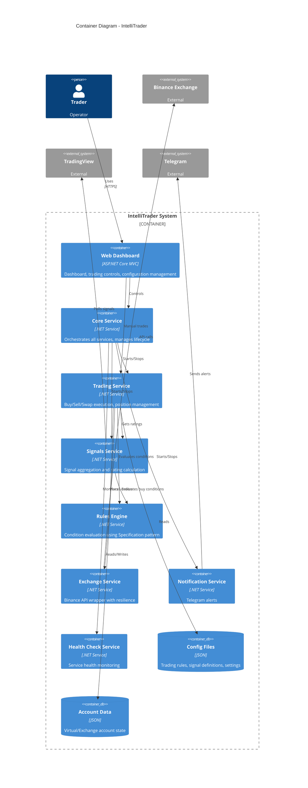

### Solution Structure

```
IntelliTrader.sln
|
+-- IntelliTrader/                    # Main executable, entry point
|   +-- Program.cs                    # Application bootstrapper
|   +-- config/                       # JSON configuration files
|
+-- IntelliTrader.Core/               # Core abstractions and services
|   +-- Interfaces/Services/          # Service contracts (ICoreService, etc.)
|   +-- Services/CoreService.cs       # Main orchestrator
|   +-- Models/Tasks/                 # HighResolutionTimedTask base
|
+-- IntelliTrader.Domain/             # Domain entities and value objects
+-- IntelliTrader.Application/        # Application services and ports
|
+-- IntelliTrader.Trading/            # Trading operations
|   +-- Services/TradingService.cs    # Facade for buy/sell/swap
|   +-- Services/*Orchestrator.cs     # Single-responsibility orchestrators
|   +-- Models/Accounts/              # Virtual/Exchange accounts
|
+-- IntelliTrader.Signals.Base/       # Signal service abstractions
+-- IntelliTrader.Signals.TradingView/# TradingView signal receiver
|
+-- IntelliTrader.Rules/              # Rule engine with Specification pattern
+-- IntelliTrader.Exchange.Base/      # Exchange abstractions
+-- IntelliTrader.Exchange.Binance/   # Binance implementation
|
+-- IntelliTrader.Infrastructure/     # Background services, telemetry
|   +-- BackgroundServices/           # Rule processors, order execution
|
+-- IntelliTrader.Web/                # ASP.NET Core dashboard
|   +-- Controllers/HomeController.cs # MVC controller
|   +-- Hubs/TradingHub.cs           # SignalR real-time updates
|   +-- MinimalApiEndpoints.cs       # REST API endpoints
|
+-- IntelliTrader.Backtesting/        # Historical replay support
+-- IntelliTrader.Integration.*/      # Third-party integrations
```

### Service Dependencies

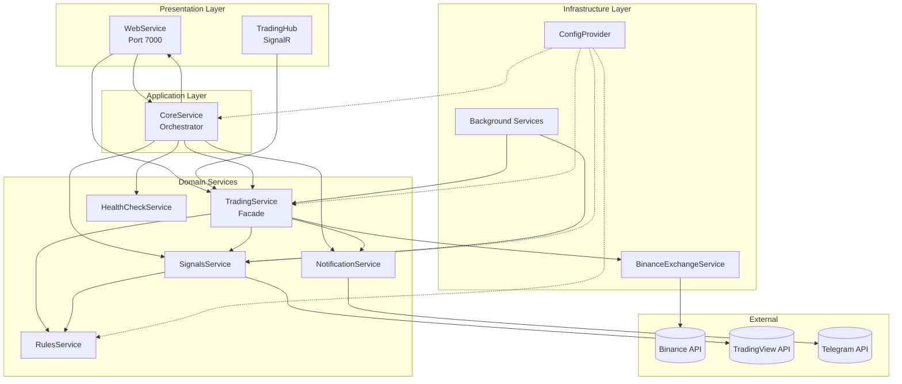

---

## 3. Key Business Flows

### 3.1 Signal Acquisition Flow

TradingView signals are polled every 7 seconds to acquire market ratings and technical indicators.

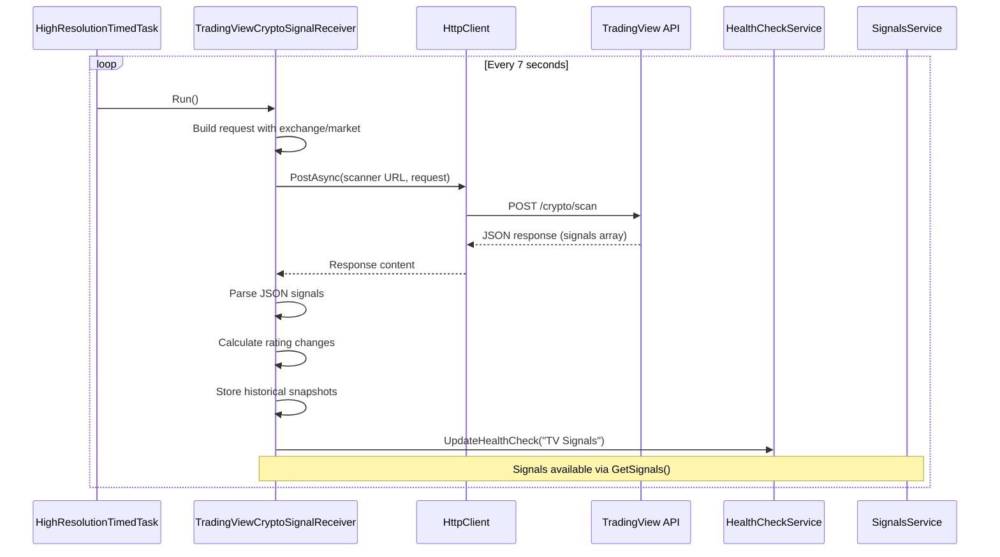

**Signal Data Structure:**
- **Pair**: Trading pair symbol (e.g., BTCUSDT)
- **Price**: Current price
- **PriceChange**: Price change percentage
- **Volume**: Trading volume
- **Rating**: Technical analysis rating (-1 to +1)
- **Volatility**: Price volatility metric
- **VolumeChange**: Volume change vs historical
- **RatingChange**: Rating change vs historical

### 3.2 Buy Decision Flow

The signal rule processor evaluates buy conditions against configured rules.

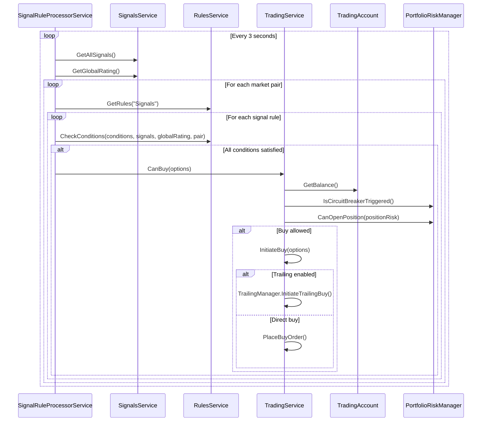

**Buy Rule Conditions (from rules.json):**
- MinVolume / MaxVolume
- MinRating / MaxRating
- MinGlobalRating / MaxGlobalRating
- MinPriceChange / MaxPriceChange

### 3.3 Sell/DCA Decision Flow

Trading rules determine when to sell positions or execute DCA (Dollar Cost Averaging) buys.

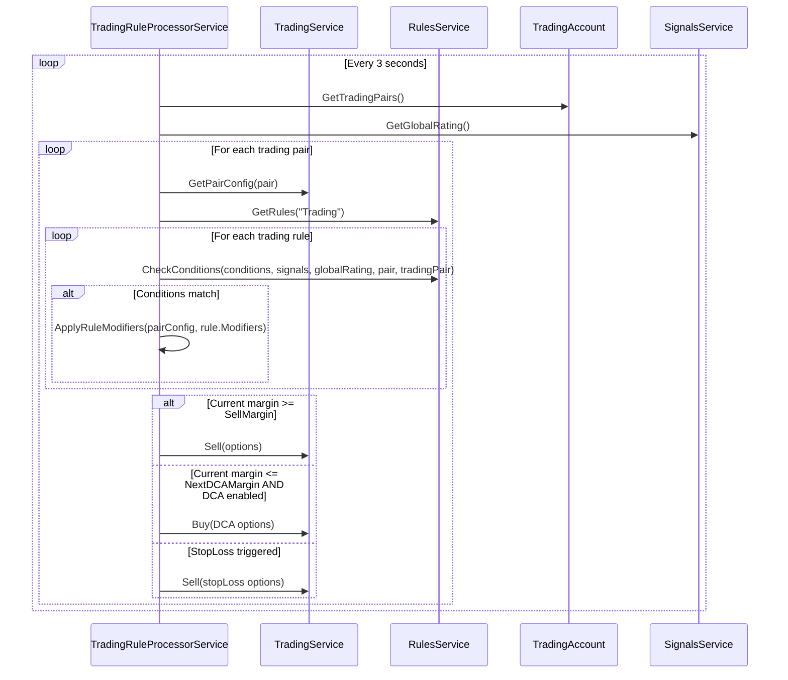

**Trading Rule Modifiers:**
- BuyEnabled / SellEnabled
- SellMargin / SellTrailing
- SellStopLossEnabled / SellStopLossMargin
- BuyDCAEnabled / DCA levels

### 3.4 Order Execution Flow

Orders are placed through the exchange service with resilience patterns.

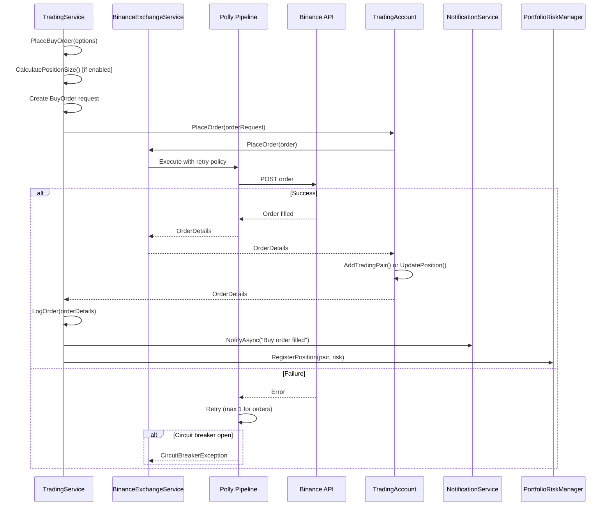

**Resilience Patterns:**
- **Read operations**: 3 retries, 30s timeout, circuit breaker
- **Order operations**: 1 retry only (critical), 15s timeout, stricter circuit breaker

---

## 4. Data Flow Diagram

### Complete Data Flow

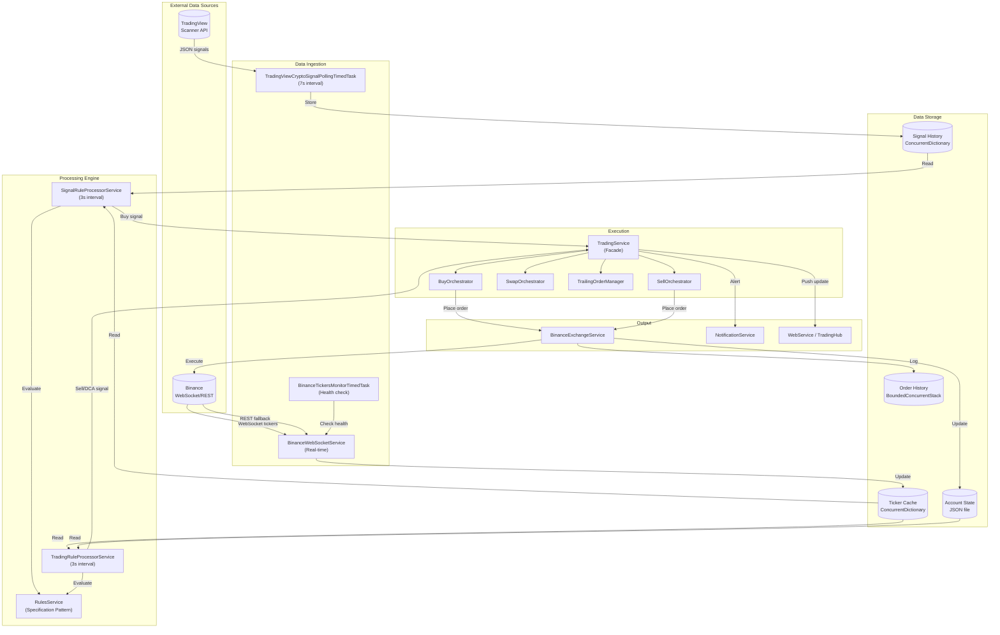

### Data Structures

| Component | Storage Type | Purpose | Retention |
|-----------|-------------|---------|-----------|
| Signal History | ConcurrentDictionary | Historical signal snapshots for change calculation | SignalPeriod + 5 minutes |
| Ticker Cache | ConcurrentDictionary | Real-time price data | Until WebSocket disconnect |
| Account State | JSON file | Trading pairs, balances, metadata | Persistent |
| Order History | BoundedConcurrentStack | Recent orders for timeout checks | MaxOrderHistorySize (configurable) |
| Trailing State | ConcurrentDictionary | Active trailing buy/sell operations | Until executed/cancelled |

---

## 5. Deployment View

### Single-Host Deployment

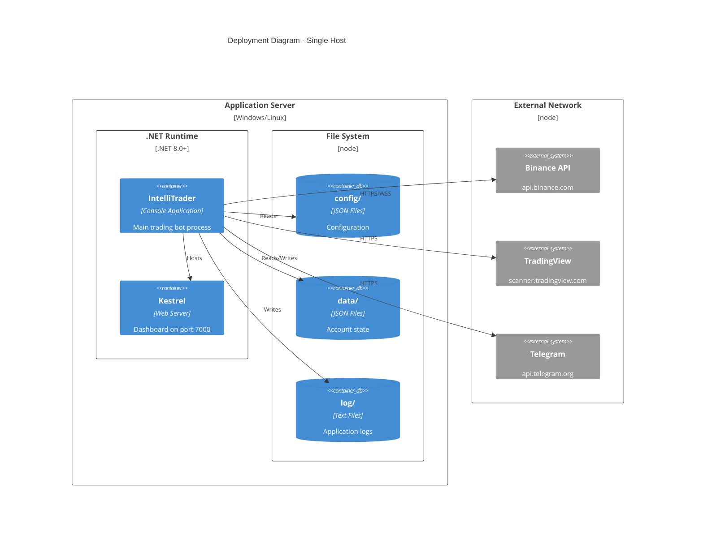

### Runtime Topology

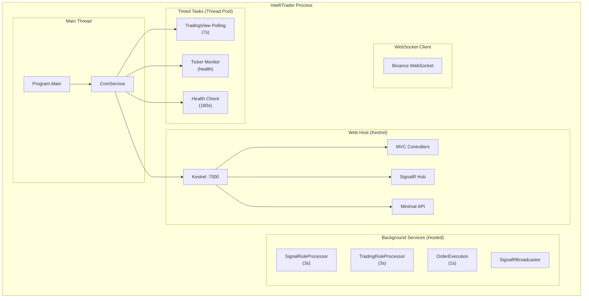

### Environment Configuration

| Environment | VirtualTrading | Exchange Keys | Web Port | Use Case |
|-------------|---------------|---------------|----------|----------|
| Development | `true` | Not required | 7000 | Strategy testing |
| Backtesting | `true` + Replay | Not required | 7000 | Historical analysis |
| Production | `false` | Encrypted file | 7000 | Live trading |

### Configuration Files

```
IntelliTrader/config/
|-- core.json           # Instance settings, health checks, password
|-- trading.json        # Exchange, market, buy/sell parameters, risk management
|-- signals.json        # TradingView signal definitions
|-- rules.json          # Signal rules (buy triggers) and trading rules (sell/DCA)
|-- web.json            # Web interface port and settings
|-- notification.json   # Telegram bot configuration
|-- exchange.json       # API keys path, rate limiting
|-- logging.json        # Log levels and output
|-- backtesting.json    # Replay settings
```

### Docker Containerization (Optional)

```dockerfile
# Example Dockerfile structure
FROM mcr.microsoft.com/dotnet/aspnet:8.0 AS base
WORKDIR /app
EXPOSE 7000

FROM mcr.microsoft.com/dotnet/sdk:8.0 AS build
WORKDIR /src
COPY . .
RUN dotnet build -c Release

FROM build AS publish
RUN dotnet publish -c Release -o /app/publish

FROM base AS final
WORKDIR /app
COPY --from=publish /app/publish .

# Mount points for persistent data
VOLUME ["/app/config", "/app/data", "/app/log"]

ENTRYPOINT ["dotnet", "IntelliTrader.dll"]
```

### Network Requirements

| Direction | Protocol | Port | Destination | Purpose |
|-----------|----------|------|-------------|---------|
| Outbound | HTTPS | 443 | api.binance.com | REST API calls |
| Outbound | WSS | 443 | stream.binance.com | Real-time tickers |
| Outbound | HTTPS | 443 | scanner.tradingview.com | Signal polling |
| Outbound | HTTPS | 443 | api.telegram.org | Notifications |
| Inbound | HTTP | 7000 | localhost | Dashboard access |

### Security Considerations

1. **API Key Protection**: Binance API keys stored in encrypted file using `CryptoUtility.SaveUnprotectedStringsToFile`
2. **Web Authentication**: Cookie-based authentication with BCrypt password hashing (legacy MD5 supported for migration)
3. **HTTPS**: External API calls use HTTPS; local dashboard accessible via HTTP (should be behind reverse proxy for production)
4. **Rate Limiting**: Binance API rate limiting configured via `RateGate`

---

## Appendix: Key Timing Intervals

| Component | Interval | Purpose |
|-----------|----------|---------|
| TradingView Signal Polling | 7 seconds | Acquire market signals |
| Signal Rules Processing | 3 seconds | Evaluate buy conditions |
| Trading Rules Processing | 3 seconds | Evaluate sell/DCA conditions |
| Order Execution | 1 second | Process pending orders |
| Health Check | 180 seconds | Service health monitoring |
| Account Refresh | 360 seconds | Sync account state |
| Ticker Staleness Threshold | 60 seconds | Trigger WebSocket reconnect |
