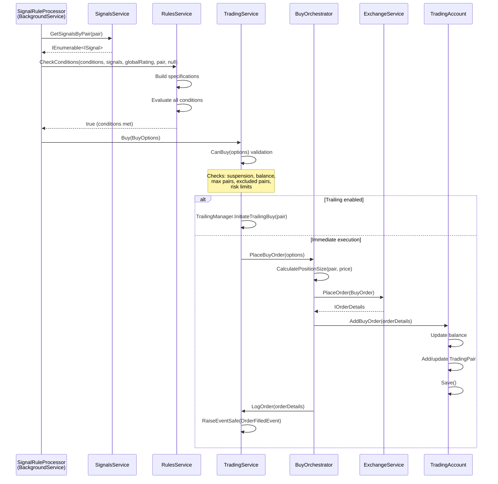
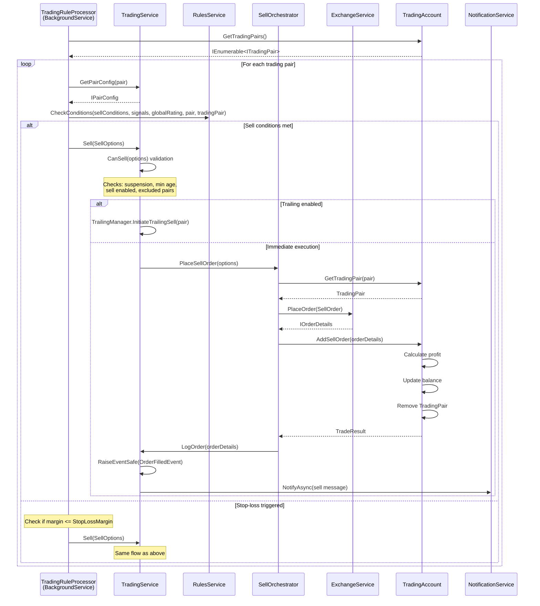
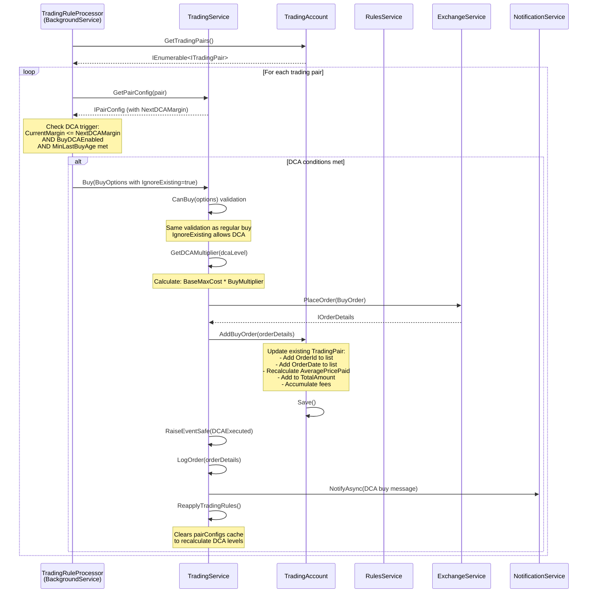

# IntelliTrader Low-Level Design (LLD)

## Table of Contents

1. [Module-by-Module Breakdown](#1-module-by-module-breakdown)
2. [Core Domain Model](#2-core-domain-model)
3. [Key Algorithms](#3-key-algorithms)
4. [API Surface](#4-api-surface)
5. [Data Layer](#5-data-layer)
6. [Sequence Diagrams](#6-sequence-diagrams)

---

## 1. Module-by-Module Breakdown

### 1.1 Core Services

#### CoreService (`IntelliTrader.Core/Services/CoreService.cs`)

The orchestrator service that manages the application lifecycle and all timed tasks.

| Property/Method | Description |
|-----------------|-------------|
| `Version` | Assembly version from `AssemblyFileVersionAttribute` |
| `Running` | Boolean indicating if the service is running |
| `timedTasks` | `ConcurrentDictionary<string, HighResolutionTimedTask>` storing all registered tasks |
| `Start()` | Starts backtesting, health check, trading, notification, and web services |
| `Stop()` | Stops all services in reverse order |
| `RestartAsync()` | Async restart with configurable timeout (default 20s) |
| `AddTask(name, task)` | Registers a timed task by name |
| `StartAllTasks()` | Starts all registered timed tasks after startup delay |

**Static Initialization:**
- Sets decimal separator to `.` for all cultures (critical for price parsing)

**Dependencies:**
- `ILoggingService`, `INotificationService`, `IHealthCheckService`
- `ITradingService`, `IWebService`, `IBacktestingService`
- `IApplicationContext`, `IConfigProvider`

---

#### TradingService (`IntelliTrader.Trading/Services/TradingService.cs`)

Facade service coordinating trading operations through specialized orchestrators.

| Property | Type | Description |
|----------|------|-------------|
| `Account` | `ITradingAccount` | Virtual or exchange account instance |
| `OrderHistory` | `BoundedConcurrentStack<IOrderDetails>` | Bounded history (100-100,000 orders) |
| `IsTradingSuspended` | `bool` | Trading suspension state |
| `Rules` | `IModuleRules` | Active trading rules |
| `RulesConfig` | `TradingRulesConfig` | Parsed trading rules configuration |

**Internal Orchestrators (lazily initialized):**
- `BuyOrchestrator` - Handles buy order placement
- `SellOrchestrator` - Handles sell order placement
- `SwapOrchestrator` - Handles pair swapping operations
- `TrailingOrderManager` - Tracks trailing buy/sell state

**Key Methods:**

```csharp
// Synchronous (backward compatibility)
void Buy(BuyOptions options)
void Sell(SellOptions options)
void Swap(SwapOptions options)

// Asynchronous (preferred)
Task BuyAsync(BuyOptions options, CancellationToken ct)
Task SellAsync(SellOptions options, CancellationToken ct)
Task SwapAsync(SwapOptions options, CancellationToken ct)

// Validation
bool CanBuy(BuyOptions options, out string message)
bool CanSell(SellOptions options, out string message)
bool CanSwap(SwapOptions options, out string message)
```

**Domain Events Raised:**
- `OrderPlacedEvent` - When an order is submitted
- `OrderFilledEvent` - When an order is filled
- `TradingSuspendedEvent` / `TradingResumedEvent` - On suspension state changes

---

#### SignalsService (`IntelliTrader.Signals.Base/Services/SignalsService.cs`)

Aggregates signals from multiple receivers (e.g., TradingView).

| Property | Type | Description |
|----------|------|-------------|
| `Rules` | `IModuleRules` | Signal rules from configuration |
| `RulesConfig` | `ISignalRulesConfig` | Parsed signal rules |

**Key Methods:**

```csharp
IEnumerable<string> GetSignalNames()           // All registered signal names
IEnumerable<ISignal> GetAllSignals()           // All signals across receivers
IEnumerable<ISignal> GetSignalsByPair(string)  // Signals for specific pair
double? GetRating(string pair, string signal)  // Single signal rating
double? GetRating(string pair, IEnumerable<string>) // Averaged rating
double? GetGlobalRating()                      // Market-wide average
```

**Signal Receiver Factory:**
```csharp
Func<string, string, IConfigurationSection, ISignalReceiver> signalReceiverFactory
```

---

#### RulesService (`IntelliTrader.Rules/Services/RulesService.cs`)

Evaluates trading conditions using the Specification pattern.

**Key Method:**
```csharp
bool CheckConditions(
    IEnumerable<IRuleCondition> conditions,
    Dictionary<string, ISignal> signals,
    double? globalRating,
    string? pair,
    ITradingPair? tradingPair)
```

**Specification Builder Flow:**
```
IRuleCondition -> ConditionSpecificationBuilder.Build() -> ISpecification<ConditionContext>
```

**Rules Change Notification:**
```csharp
void RegisterRulesChangeCallback(Action callback)
void UnregisterRulesChangeCallback(Action callback)
```

---

#### ExchangeService (`IntelliTrader.Exchange.Base/Services/ExchangeService.cs`)

Abstract base for exchange integrations.

| Property | Description |
|----------|-------------|
| `IsWebSocketConnected` | WebSocket stream status |
| `IsRestFallbackActive` | REST polling fallback status |
| `TimeSinceLastTickerUpdate` | Staleness detection |

**Abstract Methods:**
```csharp
void Start(bool virtualTrading)
void Stop()
Task<IEnumerable<ITicker>> GetTickers(string market)
Task<IEnumerable<string>> GetMarketPairs(string market)
Task<Dictionary<string, decimal>> GetAvailableAmounts()
Task<IEnumerable<IOrderDetails>> GetMyTrades(string pair)
Task<decimal> GetLastPrice(string pair)
Task<IOrderDetails> PlaceOrder(IOrder order)
```

**Events:**
```csharp
event Action<IReadOnlyCollection<ITicker>> TickersUpdated
```

---

### 1.2 Timed Tasks

#### HighResolutionTimedTask (`IntelliTrader.Core/Models/Tasks/HighResolutionTimedTask.cs`)

Abstract base class for high-precision polling operations.

| Property | Type | Default | Description |
|----------|------|---------|-------------|
| `StartDelay` | `double` | 0 | Initial delay (ms) |
| `RunInterval` | `float` | 1000 | Execution interval (ms) |
| `Priority` | `ThreadPriority` | Normal | Thread priority |
| `TimerCorrectionInterval` | `double` | 3600 | Timer restart interval for precision (s) |
| `IsEnabled` | `bool` | - | Running state |
| `RunTimes` | `long` | - | Execution counter |
| `TotalWaitTime` | `double` | - | Accumulated wait time |

**Threading Model:**
- Dedicated `Thread` with configurable priority
- `ManualResetEvent` for graceful shutdown
- `Stopwatch` for precision timing with periodic correction

---

#### BinanceTickersMonitorTimedTask

Monitors WebSocket connection health and triggers reconnection.

**Reconnection Logic:**
```
if (timeSinceLastUpdate > MaxTickersAgeToReconnectSeconds)
    if (!IsRestFallbackActive)
        DisconnectTickersWebsocket()
        ConnectTickersWebsocket()
```

---

#### TradingViewCryptoSignalPollingTimedTask

Polls TradingView for crypto signals via HTTP.

**Configuration:**
- `RequestUrl` - TradingView API endpoint
- `RequestData` - JSON template with `%EXCHANGE%`, `%MARKET%`, `%PERIOD%` placeholders
- `SignalPeriod` - Time period for signal calculation

**Signal Parsing:**
```csharp
ParseSignalFromArray(JsonElement) -> Signal
// Fields: Pair, Price, PriceChange, Volume, Rating, Volatility
```

**Historical Tracking:**
- Maintains `signalsHistory` for calculating change metrics
- Snapshot interval: 45 seconds minimum
- Retention: SignalPeriod + 5 minutes

---

### 1.3 Configuration System

#### IConfigProvider Interface

```csharp
IConfigurationSection GetSection(string name, Action<IConfigurationSection> onChange)
string GetSectionJson(string name)
void SetSectionJson(string name, string json)
```

---

#### ConfigurableServiceBase&lt;TConfig&gt; (`IntelliTrader.Core/Services/ConfigurableServiceBase.cs`)

Base class providing hot-reload configuration support.

| Property | Description |
|----------|-------------|
| `ServiceName` | Abstract - unique identifier for config section |
| `Config` | Lazy-loaded, typed configuration object |
| `RawConfig` | Raw `IConfigurationSection` |

**Hot-Reload Mechanism:**
```csharp
OnRawConfigChanged(IConfigurationSection changedRawConfig)
    -> Invalidates cached config
    -> Calls PrepareConfig()
    -> Calls OnConfigReloaded()
    -> Logs reload (if LoggingService available)
```

**Debouncing:**
- `DELAY_BETWEEN_CONFIG_RELOADS_MILLISECONDS = 500`

---

## 2. Core Domain Model

### 2.1 Key Entities

#### ITradingPair

```csharp
interface ITradingPair
{
    string Pair { get; }              // e.g., "BTCUSDT"
    string FormattedName { get; }     // e.g., "BTCUSDT(2)" for DCA level 2
    int DCALevel { get; }             // 0 = initial, 1+ = DCA buys

    List<string> OrderIds { get; }
    List<DateTimeOffset> OrderDates { get; }

    decimal TotalAmount { get; }
    decimal AveragePricePaid { get; }
    decimal FeesPairCurrency { get; }
    decimal FeesMarketCurrency { get; }
    decimal AverageCostPaid { get; }  // Calculated: Price * (Amount + PairFees) + MarketFees

    decimal CurrentPrice { get; }
    decimal CurrentCost { get; }      // Calculated: CurrentPrice * TotalAmount
    decimal CurrentMargin { get; }    // Calculated: (CurrentCost - AverageCost) / AverageCost * 100

    double CurrentAge { get; }        // Days since first order
    double LastBuyAge { get; }        // Days since last order

    OrderMetadata Metadata { get; }

    void SetCurrentPrice(decimal currentPrice);
}
```

---

#### ISignal

```csharp
interface ISignal
{
    string Name { get; }              // Signal source name
    string Pair { get; }              // Trading pair
    long? Volume { get; }             // Trading volume
    double? VolumeChange { get; set; }
    decimal? Price { get; }
    decimal? PriceChange { get; }
    double? Rating { get; }           // Technical analysis rating (-1 to 1)
    double? RatingChange { get; }
    double? Volatility { get; }
}
```

---

#### IOrder / IOrderDetails

```csharp
interface IOrder
{
    OrderSide Side { get; }           // Buy or Sell
    OrderType Type { get; }           // Market, Limit, Stop
    DateTimeOffset Date { get; }
    string Pair { get; }
    decimal Amount { get; }
    decimal Price { get; }
}

interface IOrderDetails
{
    // Inherits IOrder properties plus:
    OrderResult Result { get; }       // Filled, FilledPartially, Failed, etc.
    string OrderId { get; }
    string Message { get; }
    decimal AmountFilled { get; }
    decimal AveragePrice { get; }
    decimal Fees { get; }
    string FeesCurrency { get; }
    decimal AverageCost { get; }
    OrderMetadata Metadata { get; }
}
```

---

#### ITicker

```csharp
interface ITicker
{
    string Pair { get; }
    decimal BidPrice { get; }
    decimal AskPrice { get; }
    decimal LastPrice { get; }
}
```

---

### 2.2 Domain Events

Located in `IntelliTrader.Domain/Events/` and `IntelliTrader.Domain/SharedKernel/`.

**Base Interface:**
```csharp
interface IDomainEvent
{
    DateTimeOffset OccurredAt { get; }
    Guid EventId { get; }
    string? CorrelationId { get; }
}
```

**Trading Events:**
| Event | When Raised |
|-------|-------------|
| `OrderPlacedEvent` | Order submitted to exchange |
| `OrderFilledEvent` | Order filled (full or partial) |
| `TradingSuspendedEvent` | Trading paused |
| `TradingResumedEvent` | Trading resumed |
| `StopLossTriggeredEvent` | Stop loss condition met |
| `SignalReceivedEvent` | New signal processed |
| `RiskLimitBreachedEvent` | Risk limits exceeded |
| `DCAExecuted` | DCA buy triggered |
| `PositionOpened` / `PositionClosed` | Position lifecycle |

---

### 2.3 Value Objects and Invariants

#### DCALevel

```csharp
class DCALevel
{
    decimal Margin { get; set; }              // Trigger margin (negative %)
    decimal? BuyMultiplier { get; set; }      // Position size multiplier
    double? BuySamePairTimeout { get; set; }  // Cooldown between DCA buys
    decimal? BuyTrailing { get; set; }        // Trailing buy percentage
    decimal? BuyTrailingStopMargin { get; set; }
    BuyTrailingStopAction? BuyTrailingStopAction { get; set; }
    decimal? SellMargin { get; set; }         // Target profit margin
    decimal? SellTrailing { get; set; }       // Trailing sell percentage
    decimal? SellTrailingStopMargin { get; set; }
    SellTrailingStopAction? SellTrailingStopAction { get; set; }
}
```

#### RuleCondition

```csharp
class RuleCondition : IRuleCondition
{
    // Signal-based conditions
    string Signal { get; set; }
    long? MinVolume, MaxVolume { get; set; }
    double? MinVolumeChange, MaxVolumeChange { get; set; }
    decimal? MinPrice, MaxPrice { get; set; }
    decimal? MinPriceChange, MaxPriceChange { get; set; }
    double? MinRating, MaxRating { get; set; }
    double? MinRatingChange, MaxRatingChange { get; set; }
    double? MinVolatility, MaxVolatility { get; set; }
    double? MinGlobalRating, MaxGlobalRating { get; set; }
    List<string> Pairs { get; set; }

    // Position-based conditions
    double? MinAge, MaxAge { get; set; }
    double? MinLastBuyAge, MaxLastBuyAge { get; set; }
    decimal? MinMargin, MaxMargin { get; set; }
    decimal? MinMarginChange, MaxMarginChange { get; set; }
    decimal? MinAmount, MaxAmount { get; set; }
    decimal? MinCost, MaxCost { get; set; }
    int? MinDCALevel, MaxDCALevel { get; set; }
    List<string> SignalRules { get; set; }
}
```

**Invariants:**
- `MinVolume <= MaxVolume` (when both specified)
- `MinRating` typically in range `[-1, 1]`
- `DCALevel >= 0`
- `Margin` values are percentages (can be negative)

---

## 3. Key Algorithms

### 3.1 Signal Rating Calculation

**Single Signal Rating:**
```csharp
// SignalsService.GetRating(pair, signalName)
return GetSignalsByName(signalName)
    ?.FirstOrDefault(s => s.Pair == pair)
    ?.Rating;
```

**Averaged Multi-Signal Rating:**
```csharp
// SignalsService.GetRating(pair, signalNames)
double ratingSum = 0;
foreach (var signalName in signalNames)
{
    var rating = GetSignalsByName(signalName)
        ?.FirstOrDefault(s => s.Pair == pair)?.Rating;
    if (rating == null) return null;  // Incomplete data
    ratingSum += rating.Value;
}
return Math.Round(ratingSum / signalNames.Count(), 8);
```

**Global Rating:**
```csharp
// Averages all signal receiver's average ratings
foreach (var receiver in signalReceivers)
{
    if (Config.GlobalRatingSignals.Contains(receiver.Key))
    {
        var avgRating = receiver.Value.GetAverageRating();
        if (avgRating != null)
        {
            ratingSum += avgRating.Value;
            ratingCount++;
        }
    }
}
return ratingCount > 0 ? Math.Round(ratingSum / ratingCount, 8) : null;
```

---

### 3.2 Rule Condition Evaluation

Uses the **Specification Pattern** for composable business rules.

**Specification Building:**
```csharp
// ConditionSpecificationBuilder.Build(IRuleCondition)
var specifications = new List<ISpecification<ConditionContext>>();

// Add specifications only if they have constraints
if (volumeSpec.HasConstraints) specifications.Add(volumeSpec);
if (ratingSpec.HasConstraints) specifications.Add(ratingSpec);
// ... (price, volatility, globalRating, pairs, age, margin, amount, dcaLevel, signalRules)

if (specifications.Count == 0)
    return new TrueSpecification<ConditionContext>();

return new CompositeAndSpecification<ConditionContext>(specifications);
```

**Evaluation:**
```csharp
// RulesService.CheckConditions()
foreach (var condition in conditions)
{
    var context = ConditionContext.Create(signals, condition.Signal,
        globalRating, pair, tradingPair, applicationContext.Speed);

    var specification = ConditionSpecificationBuilder.Build(condition);

    if (!specification.IsSatisfiedBy(context))
        return false;  // Short-circuit on first failure
}
return true;
```

---

### 3.3 DCA (Dollar Cost Averaging) Logic

**DCA Level Determination:**
```csharp
// TradingPair.DCALevel
int DCALevel => (OrderDates?.Count - 1 ?? 0) + (Metadata?.AdditionalDCALevels ?? 0);
```

**DCA Multiplier Resolution:**
```csharp
// TradingService.GetDCAMultiplier(dcaLevel)
if (Config.DCALevels != null && dcaLevel < Config.DCALevels.Count)
    return Config.DCALevels[dcaLevel].BuyMultiplier ?? 1;
return 1;
```

**DCA Margin Thresholds:**
```csharp
// Current DCA margin (last triggered level)
decimal? GetCurrentDCAMargin(int dcaLevel)
{
    if (dcaLevel == 0) return null;
    if (Config.DCALevels != null && dcaLevel - 1 < Config.DCALevels.Count)
        return Config.DCALevels[dcaLevel - 1].Margin;
    return null;
}

// Next DCA margin (upcoming trigger)
decimal? GetNextDCAMargin(int dcaLevel)
{
    if (Config.DCALevels != null && dcaLevel < Config.DCALevels.Count)
        return Config.DCALevels[dcaLevel].Margin;
    return null;
}
```

---

### 3.4 Position Sizing Calculations

#### Fixed Percentage Sizing

```csharp
decimal riskAmount = accountBalance * riskPercent;
decimal positionSize = riskAmount;

// Cap by max position
decimal maxPositionSize = accountBalance * maxPositionPercent;
if (positionSize > maxPositionSize)
{
    positionSize = maxPositionSize;
    wasCapped = true;
}
```

#### Kelly Criterion Sizing

**Formula:**
```
Kelly % = W - [(1 - W) / R]

Where:
  W = Win rate (probability of winning)
  R = Win/Loss ratio (average win / average loss)
```

**Implementation:**
```csharp
// KellyCriterionPositionSizer.CalculatePositionSizeWithDetails()
decimal rawKellyPercent = winRate - ((1 - winRate) / winLossRatio);

if (rawKellyPercent <= 0)
    return PositionSize = 0;  // Negative edge - don't trade

// Apply fractional Kelly (default 0.5 = half Kelly)
decimal adjustedKellyPercent = rawKellyPercent * kellyFraction;

// Additional cap by configured risk percent
adjustedKellyPercent = Math.Min(adjustedKellyPercent, context.RiskPercent * 10);

decimal positionSize = accountBalance * adjustedKellyPercent;
positionSize = Math.Min(positionSize, accountBalance * maxPositionPercent);
```

**Trading Statistics Calculation:**
```csharp
// TradingService.CalculateTradingStatistics(minTrades)
// Groups orders by pair, matches buy/sell pairs
// Calculates:
//   - Win rate: wins / total trades
//   - Avg Win/Loss: avgWin / avgLoss
```

---

## 4. API Surface

### 4.1 Web Controllers

#### HomeController (`IntelliTrader.Web/Controllers/HomeController.cs`)

| Route | Method | Description |
|-------|--------|-------------|
| `/` | GET | Redirects to Dashboard |
| `/Dashboard` | GET | Main trading dashboard |
| `/Market` | GET | Market overview page |
| `/Stats` | GET | Trading statistics |
| `/Trades/{date}` | GET | Trades for specific date |
| `/Settings` | GET/POST | Configuration management |
| `/Log` | GET | Log viewer (last 500 entries) |
| `/Help` | GET | Help documentation |
| `/Login` | GET/POST | Authentication |
| `/Logout` | GET | Sign out |

**Trading Actions:**

| Route | Method | Input Model | Description |
|-------|--------|-------------|-------------|
| `/Sell` | POST | `SellInputModel` | Manual sell order |
| `/Buy` | POST | `BuyInputModel` | Manual buy with amount |
| `/BuyDefault` | POST | `BuyDefaultInputModel` | Buy with default cost |
| `/Swap` | POST | `SwapInputModel` | Swap positions |
| `/SaveConfig` | POST | `ConfigUpdateModel` | Update configuration |
| `/RefreshAccount` | GET | - | Force account refresh |
| `/RestartServices` | GET | - | Restart all services |

**Password Management:**

| Route | Method | Description |
|-------|--------|-------------|
| `/GeneratePasswordHash` | POST | Generate BCrypt hash |
| `/PasswordStatus` | GET | Check current hash type |

**Legacy Endpoints (Deprecated):**

| Route | Replacement |
|-------|-------------|
| `/Status` | `GET /api/status` |
| `/SignalNames` | `GET /api/signal-names` |
| `/TradingPairs` | `POST /api/trading-pairs` |
| `/MarketPairs` | `POST /api/market-pairs` |

---

### 4.2 SignalR Hub

#### TradingHub (`IntelliTrader.Web/Hubs/TradingHub.cs`)

**Connection Lifecycle:**
```csharp
OnConnectedAsync()    // Adds to TradingUpdatesGroup, sends initial status
OnDisconnectedAsync() // Removes from groups, cleans up subscriptions
```

**Client-to-Server Methods:**

| Method | Parameters | Description |
|--------|------------|-------------|
| `SubscribeToPair` | `string pair` | Subscribe to pair updates |
| `UnsubscribeFromPair` | `string pair` | Unsubscribe from pair |
| `RequestStatus` | - | Request immediate status |
| `RequestTradingPairs` | - | Request current positions |
| `RequestHealthStatus` | - | Request health checks |

**Server-to-Client Events:**

| Event | Payload | Description |
|-------|---------|-------------|
| `StatusUpdate` | Status object | Trading status update |
| `TradingPairsUpdate` | Trading pairs list | Position updates |
| `PriceUpdate` | `{Pair, Price, Timestamp}` | Price changes |
| `HealthStatus` | Health check data | System health |

**Groups:**
- `TradingUpdates` - All clients receive trading updates
- `Pair_{SYMBOL}` - Per-pair subscription groups

---

### 4.3 Data Transfer Objects

#### Input Models

```csharp
class SellInputModel
{
    [Required] string Pair { get; set; }
    decimal? Amount { get; set; }
}

class BuyInputModel
{
    [Required] string Pair { get; set; }
    [Required] decimal Amount { get; set; }
}

class BuyDefaultInputModel
{
    [Required] string Pair { get; set; }
}

class SwapInputModel
{
    [Required] string Pair { get; set; }    // Old pair
    [Required] string Swap { get; set; }    // New pair
}

class ConfigUpdateModel
{
    [Required] string Name { get; set; }
    [Required] string Definition { get; set; }  // JSON
    bool IsValidJson() { ... }
}
```

---

## 5. Data Layer

### 5.1 In-Memory State Management

#### Trading Account State

```csharp
// TradingAccountBase
protected decimal balance;
protected ConcurrentDictionary<string, TradingPair> tradingPairs;
protected bool isInitialRefresh = true;
```

**Thread Safety:**
- `SyncRoot` object for lock synchronization
- `ConcurrentDictionary` for trading pairs collection
- `lock (SyncRoot)` in all mutation methods

#### Order History

```csharp
// BoundedConcurrentStack<IOrderDetails>
// Configured via trading.json: MaxOrderHistorySize (100-100,000)
// Auto-trims oldest orders when limit exceeded

OrderHistory.Push(order);  // Add new order
OrderHistory.ItemsArchived += (s, e) => { /* handle trimmed orders */ };
```

#### Signal Cache

```csharp
// TradingViewCryptoSignalPollingTimedTask
ConcurrentDictionary<DateTimeOffset, List<Signal>> signalsHistory;
List<Signal>? signals;
double? averageRating;
```

#### Trailing Orders Tracking

```csharp
// TrailingOrderManager
ConcurrentDictionary<string, bool> trailingBuys;
ConcurrentDictionary<string, bool> trailingSells;
```

---

### 5.2 JSON Configuration Persistence

**Configuration Files (`IntelliTrader/config/`):**

| File | Service | Description |
|------|---------|-------------|
| `core.json` | CoreService | Health checks, password, instance name |
| `trading.json` | TradingService | Market, exchange, buy/sell/DCA settings |
| `signals.json` | SignalsService | Signal definitions and receivers |
| `rules.json` | RulesService | Signal and trading rules |
| `web.json` | WebService | Port, authentication settings |
| `notification.json` | NotificationService | Telegram integration |
| `backtesting.json` | BacktestingService | Replay settings |

**Hot-Reload Flow:**
```
File change detected
    -> IConfigProvider raises change event
    -> ConfigurableServiceBase.OnRawConfigChanged()
    -> Cache invalidated (config = null)
    -> PrepareConfig() called
    -> OnConfigReloaded() called
    -> Registered callbacks invoked
```

---

### 5.3 Order History Tracking

#### Trade Results Logging

```csharp
// Logged to log/*-trades.txt
// Format: TradeResult { JSON payload }
class TradeResult
{
    bool IsSuccessful { get; set; }
    OrderMetadata Metadata { get; set; }
    string Pair { get; set; }
    decimal Amount { get; set; }
    List<DateTimeOffset> OrderDates { get; set; }
    decimal AveragePricePaid { get; set; }
    decimal FeesPairCurrency { get; set; }
    decimal FeesMarketCurrency { get; set; }
    DateTimeOffset SellDate { get; set; }
    decimal SellPrice { get; set; }
    decimal BalanceDifference { get; set; }
    decimal Profit { get; set; }
}
```

**Log Parsing (Stats Page):**
```csharp
// HomeController.GetTrades()
var pattern = new Regex(@"TradeResult (?<data>\{.*\})");
// Parses JSON from log lines for historical analysis
```

---

## 6. Sequence Diagrams

### 6.1 Buy Signal Processing Sequence



### 6.2 Sell Order Execution Sequence



### 6.3 DCA Trigger Sequence



---

## Appendix: Configuration Constants

```csharp
// Constants.cs
public static class Constants
{
    public static class ServiceNames
    {
        const string CoreService = "Core";
        const string TradingService = "Trading";
        const string SignalsService = "Signals";
        const string RulesService = "Rules";
        const string ExchangeService = "Exchange";
        // ...
    }

    public static class Trading
    {
        const int DefaultMaxOrderHistorySize = 10000;
        const int MinOrderHistorySize = 100;
        const int MaxOrderHistorySize = 100000;
    }

    public static class Resilience
    {
        const int DefaultReadTimeoutSeconds = 30;
        const int DefaultOrderTimeoutSeconds = 15;
        const int DefaultReadMaxRetryAttempts = 3;
        const int DefaultOrderMaxRetryAttempts = 1;  // Critical: prevent duplicate orders
        const int DefaultRateLimitPermitsPerMinute = 1000;  // Below Binance 1200/min
    }

    public static class WebSocket
    {
        const int PingIntervalSeconds = 20;
        const int ReconnectDelaySeconds = 5;
        const int MaxReconnectAttempts = 5;
        const int MaxTickersAgeSeconds = 60;
    }
}
```
