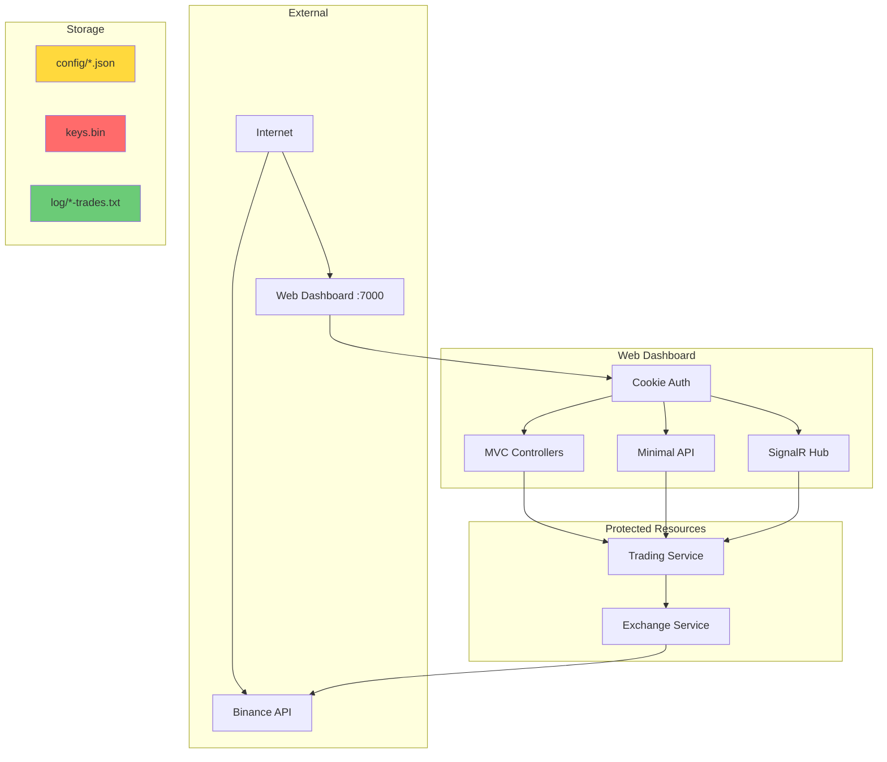
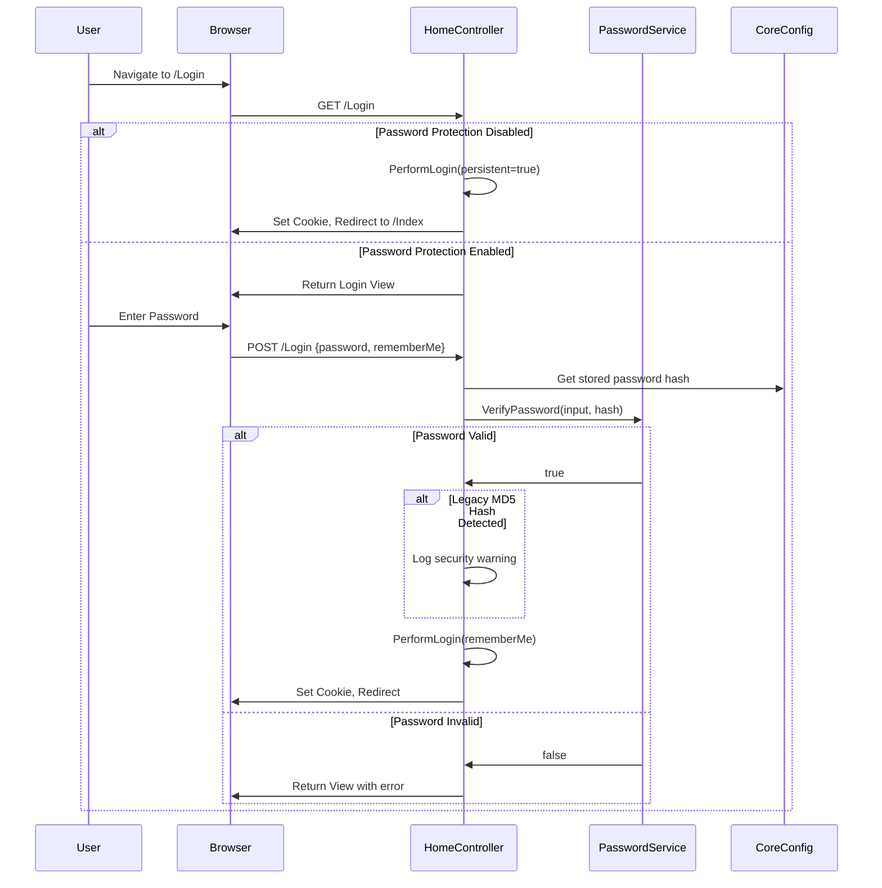

# Security & Compliance Documentation

This document provides security guidance for deploying and operating IntelliTrader in production environments. All recommendations are based on analysis of the actual codebase.

## Table of Contents

- [Threat Model](#threat-model)
- [Authentication & Authorization](#authentication--authorization)
- [Secret Handling](#secret-handling)
- [Input Validation](#input-validation)
- [Dependency Security](#dependency-security)
- [Security Checklist for Production](#security-checklist-for-production)

---

## Threat Model

### Assets to Protect

| Asset | Location | Sensitivity |
|-------|----------|-------------|
| Exchange API Keys | `keys.bin` (encrypted) | **Critical** - Grants trading access |
| Trading Funds | Binance exchange account | **Critical** - Financial loss risk |
| Dashboard Password | `config/core.json` (hashed) | **High** - Controls application access |
| Configuration Files | `config/*.json` | **Medium** - Contains trading parameters |
| Trade History | `log/*-trades.txt` | **Medium** - Business intelligence |
| Session Cookies | Browser | **Medium** - Authenticated access |

### Threat Actors

| Actor | Motivation | Capability |
|-------|------------|------------|
| External Attacker | Financial gain, data theft | Network access, web exploits |
| Malicious Configuration | Sabotage, fund extraction | Physical access to config files |
| Compromised Dependency | Supply chain attack | Code execution |

### Attack Surfaces



---

## Authentication & Authorization

### Web Dashboard Authentication

The web dashboard uses ASP.NET Core Cookie Authentication with BCrypt password hashing.

#### Password Service Implementation

**Location**: `IntelliTrader.Web/Services/PasswordService.cs`

```csharp
public class PasswordService : IPasswordService
{
    private const int DefaultWorkFactor = 12;  // ~250ms on modern hardware

    public string HashPassword(string password)
    {
        return BCrypt.Net.BCrypt.HashPassword(password, workFactor: DefaultWorkFactor);
    }

    public bool VerifyPassword(string password, string storedHash)
    {
        // Supports both BCrypt ($2a$/$2b$/$2y$) and legacy MD5 (32 hex chars)
        if (IsBCryptHash(storedHash))
        {
            return BCrypt.Net.BCrypt.Verify(password, storedHash);
        }
        if (IsLegacyHash(storedHash))
        {
            return ComputeMD5Hash(password).Equals(storedHash, StringComparison.OrdinalIgnoreCase);
        }
        return false;
    }
}
```

**Security Characteristics**:
- BCrypt work factor 12 provides approximately 250ms verification time
- Backward compatibility with legacy MD5 hashes (migration recommended)
- Null/empty password rejection at service level

#### Authentication Flow



#### Session Management

**Configuration**: `IntelliTrader.Web/Startup.cs`

```csharp
services.AddAuthentication(options =>
{
    options.DefaultSignInScheme = CookieAuthenticationDefaults.AuthenticationScheme;
    options.DefaultAuthenticateScheme = CookieAuthenticationDefaults.AuthenticationScheme;
    options.DefaultChallengeScheme = CookieAuthenticationDefaults.AuthenticationScheme;
}).AddCookie(options =>
{
    options.LoginPath = "/Login";
    options.Cookie.Name = $"IntelliTrader_{coreService.Config.InstanceName}";
});
```

**Session Properties**:
- Cookie name includes instance name for multi-instance deployments
- Persistent option controlled by "Remember Me" checkbox
- No explicit session timeout configured (uses ASP.NET Core defaults)

#### Authorization Enforcement

All protected endpoints require authentication:

| Component | Protection | Location |
|-----------|------------|----------|
| HomeController | `[Authorize]` class attribute | `Controllers/HomeController.cs:19` |
| TradingHub | `[Authorize]` class attribute | `Hubs/TradingHub.cs:18` |
| Minimal API | `.RequireAuthorization()` group | `MinimalApiEndpoints.cs:22` |

#### CSRF Protection

State-changing MVC actions use `[ValidateAntiForgeryToken]`:

| Action | Line | Purpose |
|--------|------|---------|
| GeneratePasswordHash | 143 | Password hash generation |
| Settings (POST) | 468 | Toggle trading settings |
| SaveConfig | 488 | Save configuration changes |
| Sell | 507 | Manual sell order |
| Buy | 524 | Manual buy order |
| BuyDefault | 542 | Manual buy with default amount |
| Swap | 564 | Manual swap operation |

**Note**: Minimal API endpoints (lines 21-199) do not have explicit CSRF protection but require authentication and use POST for state-changing operations.

---

## Secret Handling

### Exchange API Keys

API keys for Binance are stored encrypted using Windows DPAPI (Data Protection API) via ExchangeSharp's `CryptoUtility`.

#### Encryption Process

**Location**: `IntelliTrader/Program.cs:68-77`

```csharp
private static void EncryptKeys(Dictionary<string, string> args)
{
    var path = args["path"];
    var publicKey = args["publickey"];
    var privateKey = args["privatekey"];

    CryptoUtility.SaveUnprotectedStringsToFile(path, new string[] { publicKey, privateKey });
}
```

**Usage**:
```bash
dotnet IntelliTrader.dll --encrypt --path=keys.bin --publickey=YOUR_API_KEY --privatekey=YOUR_API_SECRET
```

**Security Properties**:
- Encrypted file bound to current Windows user and machine
- Cannot be decrypted on different machine or by different user
- File path configurable via `config/exchange.json`:

```json
{
  "Exchange": {
    "KeysPath": "keys.bin"
  }
}
```

#### Configuration Files

Configuration files in `config/` directory are stored as plaintext JSON:

| File | Contains Sensitive Data | Notes |
|------|------------------------|-------|
| `core.json` | Password hash (BCrypt) | Hash is safe to store |
| `exchange.json` | Path to keys.bin | Keys themselves encrypted |
| `trading.json` | Trading parameters | No secrets |
| `signals.json` | Signal definitions | No secrets |
| `rules.json` | Trading rules | No secrets |
| `web.json` | Port number only | No secrets |
| `notification.json` | Telegram tokens | **Contains secrets** |

**Warning**: `notification.json` may contain Telegram bot tokens which should be treated as secrets.

#### Environment Variables

The codebase does not currently use environment variables for secret management. All configuration is file-based.

---

## Input Validation

### FluentValidation for Configuration

Configuration files are validated on load using FluentValidation.

**Service**: `IntelliTrader.Core/Validation/ConfigValidationService.cs`

```csharp
public class ConfigValidationService : IConfigValidationService
{
    public ConfigValidationService()
    {
        RegisterValidator<ITradingConfig>(new TradingConfigValidator());
        RegisterValidator<ICoreConfig>(new CoreConfigValidator());
        RegisterValidator<ISignalsConfig>(new SignalsConfigValidator());
        RegisterValidator<IRulesConfig>(new RulesConfigValidator());
    }

    public void ValidateAndThrow<T>(T config, string sectionName) where T : class
    {
        var result = Validate(config);
        if (!result.IsValid)
        {
            throw new ConfigValidationException(sectionName, result.Errors);
        }
    }
}
```

#### Core Config Validation

**Location**: `IntelliTrader.Core/Validation/CoreConfigValidator.cs`

| Property | Rule | Purpose |
|----------|------|---------|
| InstanceName | Not empty, max 50 chars, alphanumeric | Prevent injection |
| TimezoneOffset | Between -12 and +14 | Valid UTC offsets |
| Password | Min 8 chars (when not hashed) | Password strength |
| HealthCheckInterval | 10-3600 seconds | Prevent abuse |

#### Trading Config Validation

**Location**: `IntelliTrader.Core/Validation/TradingConfigValidator.cs`

| Property | Rule | Purpose |
|----------|------|---------|
| Market | Allowlist: BTC, ETH, USDT, BUSD, BNB, EUR, USD, GBP | Prevent invalid markets |
| Exchange | Allowlist: Binance | Supported exchanges only |
| MaxPairs | 1-100 | Resource limits |
| ExcludedPairs | Regex: uppercase alphanumeric 5-15 chars | Format validation |
| BuyMaxCost | > 0 | Positive values only |
| SellStopLossMargin | < 0 (when enabled) | Must be negative |

### Request Validation in Controllers

Web input uses Data Annotations for validation.

**Location**: `IntelliTrader.Web/Models/TradingInputModels.cs`

#### Trading Pair Validation

All trading pair inputs use consistent regex validation:

```csharp
[Required(ErrorMessage = "Trading pair is required")]
[RegularExpression(@"^[A-Z0-9]{2,20}$",
    ErrorMessage = "Invalid trading pair format. Must be 2-20 uppercase alphanumeric characters")]
public string Pair { get; set; }
```

#### Amount Validation

```csharp
[Required(ErrorMessage = "Amount is required")]
[Range(0.00000001, 1000000000, ErrorMessage = "Amount must be between 0.00000001 and 1,000,000,000")]
public decimal Amount { get; set; }
```

#### Config Update Validation

```csharp
public class ConfigUpdateModel
{
    [Required]
    [RegularExpression(@"^(core|trading|signals|rules|web|notification)$")]
    public string Name { get; set; }

    [Required]
    public string Definition { get; set; }

    public bool IsValidJson()
    {
        try { JsonDocument.Parse(Definition); return true; }
        catch (JsonException) { return false; }
    }
}
```

Controller validates JSON before saving:

```csharp
[HttpPost]
[ValidateAntiForgeryToken]
public IActionResult SaveConfig([FromForm] ConfigUpdateModel model)
{
    if (!ModelState.IsValid) return BadRequest(ModelState);
    if (!model.IsValidJson()) return BadRequest("Invalid JSON format");

    _configProvider.SetSectionJson(model.Name, model.Definition);
    return Ok();
}
```

### SignalR Input Validation

**Location**: `IntelliTrader.Web/Hubs/TradingHub.cs`

```csharp
public async Task SubscribeToPair(string pair)
{
    if (string.IsNullOrWhiteSpace(pair))
    {
        _logger.LogWarning("Client {ConnectionId} attempted to subscribe with null/empty pair",
            Context.ConnectionId);
        return;
    }

    var normalizedPair = pair.ToUpperInvariant();
    // ... subscription logic
}
```

---

## Dependency Security

### NuGet Package Management

The solution uses standard NuGet package references without lockfiles.

**Lockfile Status**: No `packages.lock.json` files detected in the repository.

**Recommendation**: Enable NuGet package locking for reproducible builds:

```xml
<!-- In Directory.Build.props -->
<PropertyGroup>
    <RestorePackagesWithLockFile>true</RestorePackagesWithLockFile>
</PropertyGroup>
```

### Key Dependencies

| Package | Purpose | Security Consideration |
|---------|---------|----------------------|
| BCrypt.Net-Next | Password hashing | Well-maintained, industry standard |
| ExchangeSharp | Exchange API, key encryption | Uses Windows DPAPI |
| FluentValidation | Input validation | No known vulnerabilities |
| Polly | Resilience policies | Rate limiting, circuit breaker |
| Microsoft.AspNetCore.* | Web framework | Security patches via .NET updates |

### Node.js Dependencies

The repository contains `node_modules/` (likely for tooling). This is separate from the .NET application.

---

## Security Checklist for Production

### Pre-Deployment

- [ ] **Generate BCrypt password hash** - Use `/GeneratePasswordHash` endpoint or update `core.json` directly
- [ ] **Verify no legacy MD5 hash** - Check `/PasswordStatus` endpoint returns `"HashType": "BCrypt (secure)"`
- [ ] **Encrypt API keys on target machine** - Run `--encrypt` command on production server
- [ ] **Review `notification.json`** - Ensure Telegram tokens are not committed to version control
- [ ] **Set `DebugMode: false`** - In both `core.json` and `web.json`
- [ ] **Configure HTTPS** - Use reverse proxy (nginx, IIS) with TLS termination
- [ ] **Restrict network access** - Web dashboard should not be exposed to public internet

### Configuration Security

- [ ] **Validate all config files** - Application validates on startup; review any validation errors
- [ ] **Set appropriate `MaxPairs`** - Limit concurrent trading pairs
- [ ] **Configure `BuyMinBalance`** - Prevent over-trading
- [ ] **Enable `HealthCheckEnabled`** - Monitor exchange connectivity
- [ ] **Review `ExcludedPairs`** - Block unwanted trading pairs

### Runtime Security

- [ ] **Monitor trade logs** - Review `log/*-trades.txt` for anomalies
- [ ] **Check health endpoint** - Monitor `/api/status` for suspended trading
- [ ] **Review SignalR connections** - Monitor for unusual subscription patterns
- [ ] **Enable application logging** - Configure appropriate log levels in `logging.json`

### API Key Security

- [ ] **Use IP allowlist on Binance** - Restrict API key to production server IP
- [ ] **Enable withdrawal address whitelist** - Prevent fund extraction if keys compromised
- [ ] **Disable withdrawal permission** - If not needed, remove from API key
- [ ] **Regular key rotation** - Periodically generate new API keys

### Backup & Recovery

- [ ] **Backup `keys.bin`** - Encrypted file must be backed up (same machine/user only)
- [ ] **Backup configuration** - Store `config/` directory in version control (excluding secrets)
- [ ] **Document recovery procedure** - Key re-encryption required on new machine

---

## Appendix: Password Migration

If using a legacy MD5 hash, migrate to BCrypt:

1. Login with current password
2. Navigate to Settings or use API endpoint
3. POST to `/GeneratePasswordHash` with new password (form data: `password=YourNewPassword`)
4. Copy the returned BCrypt hash to `config/core.json`:

```json
{
  "Core": {
    "PasswordProtected": true,
    "Password": "$2a$12$LQv3c1yqBWVHxkd0LHAkCOYz6TtxMQJqhN8/X4/jJrZk.oB8C6.Hy"
  }
}
```

5. Restart the application

The application logs a security warning on each login when using legacy MD5 hashes to encourage migration.
